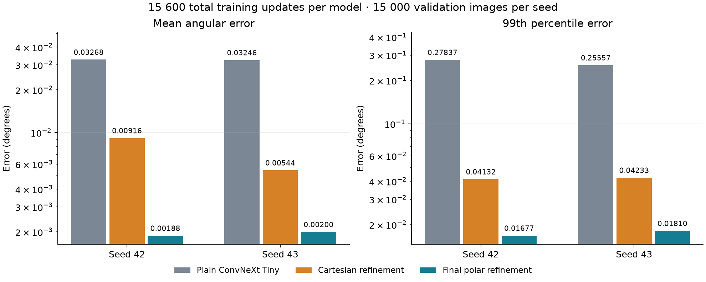
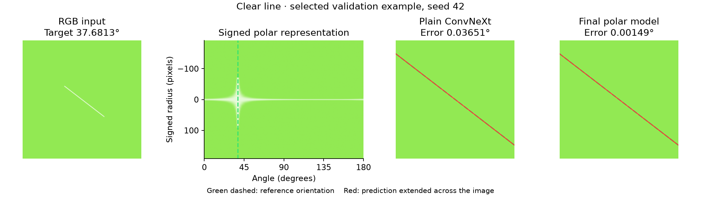
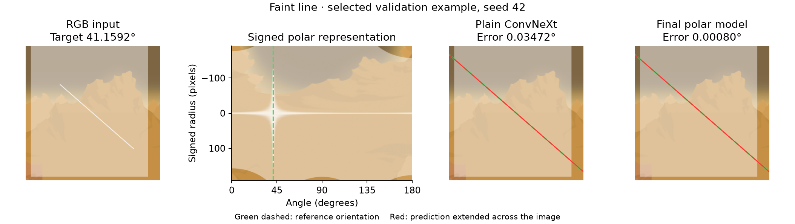
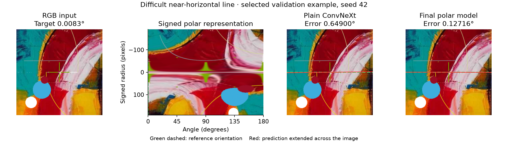

# Angle-Predictor

[English](README.md) · [Русский](README.ru.md)

Estimating the angle of a thin line in cluttered images with signed polar
coordinates and a coarse-to-fine neural network.

The final model reaches **0.001880° and 0.001997° validation MAE** on two
seeds. At the same 15 600-update training budget, it reduces MAE by
**94.25% and 93.85%** compared with a standard ConvNeXt Tiny on RGB images.

## Results

Each model received **15 600 total task-training updates**, including any reused
checkpoints. Each cell reports seed 42 / seed 43 on 15 000 matching validation
images per seed. All errors are in degrees.

| Model | MAE ↓ | P99 ↓ | Maximum ↓ |
| --- | ---: | ---: | ---: |
| Plain ConvNeXt Tiny on RGB | 0.032679 / 0.032459 | 0.278369 / 0.255570 | 2.702152 / 4.141962 |
| Spatial head and local RGB refinement | 0.009159 / 0.005435 | 0.041323 / 0.042328 | 60.444824 / 3.282609 |
| **Final polar model** | 0.001880 / 0.001997 | 0.016774 / 0.018103 | 0.425582 / 1.051895 |

The RGB control keeps the stock ConvNeXt architecture apart from its two angle
outputs. The middle model adds a spatial head and local Cartesian refinement
without polar resampling. The final pipeline reduces P99 error by
**93.97% and 92.92%** relative to the stock RGB control.
This compares complete training recipes, with equal update counts rather than
equal computation. It does not isolate polar geometry from the other changes.



The [RGB and polar comparison report](docs/reports/cartesian-comparison/README.md)
covers training curves, difficult subsets, large errors and computational cost.

## Prediction examples

Selected validation examples show the input, its polar representation and the
predictions from plain ConvNeXt and the final model. Green dashed lines indicate
the reference orientation and red lines indicate the prediction. Numerical
labels show errors that are too small to distinguish visually.







## What changed during the research

The starting point was an ImageNet-initialized ConvNeXt Tiny operating on a
polar image. Its tuned standalone MAE was 0.010441° and 0.010615° after
5 200 steps. The work covered data generation, angle representation, loss and
optimizer selection, then 121 completed architecture training runs.

Smaller backbones and pruned Tiny variants reduced computation but did not
preserve accuracy under the tested recipe. Error analysis showed two different
problems: choosing the correct line among distractors and measuring its angle
precisely. A local correction branch improved the second task while retaining
Tiny for the first.

The refinement experiments then changed one part of the representation at a
time and compared against the corresponding parent at equal training cost.

| Change | Why it was tested | MAE reduction, seed 42 / 43 |
| --- | --- | ---: |
| Preserve 384 radial crop samples instead of 192 | Retain detail from faint and interrupted segments | 12.03% / 7.16% |
| Increase the last fine layer from 32 to 64 channels | Give the local encoder more capacity | 7.41% / 9.36% |
| Filter before radial downsampling | Reduce sensitivity to the sampled feature rows | 5.74% / 6.20% |
| Use 65 angular samples with a proportionally wider kernel | Preserve small angular shifts while retaining context | 20.79% / 16.01% |
| Increase the last fine layer from 64 to 128 channels after matched continuation | Improve the final local representation and correction projection | 4.63% / 3.09% |

The first four rows use 10 400 total steps. The last uses 15 600.
These are separate comparisons, so their percentages should not be added.
The final 23-sample angular kernel covers the full refinement window.
Larger radial kernels, extra pooling bins, a denser final radial feature map
and alternative correction heads did not provide consistent further gains.


Earlier experiments established the training recipe. Vector Charbonnier
reduced mean error by **25.4% relative to MSE across ten seeds**. MuSGD had
the lowest median error among three optimizer families under the tested
hyperparameter search. Its subsequent learning-rate and weight-decay tuning
produced the standalone Tiny baseline used in the architecture comparisons.
These studies used different comparisons and are reported separately from
the architectural gains.

## Why polar coordinates help

In the original image, changing a line's angle changes its slope across both
pixel axes. A small rotation moves pixels near the ends more than those near
the center. Measuring a very small angular difference therefore requires
combining evidence from distant parts of the segment.

The polar transform reorganizes that evidence around the known image center.
Each column samples one orientation, and each row samples a distance along
that orientation:

```text
P(r, θ) = I(cx + r cos θ, cy + r sin θ)
```

Here `I` is the RGB image and `(cx, cy)` is its center. The radius `r` runs
from negative to positive values, so one column follows an entire diameter
through the center. Angles cover 0° to 180°. This signed radius represents
both halves of an undirected line without needing a separate 360° image.
The sampler uses the largest circle inside the input square, leaving the
corners outside the representation.

A line through the center becomes a narrow band along the radial axis,
located at its orientation. For example, a 30° line appears near the 30°
column. Rotating it to 31° moves its response along the angular axis instead
of giving the network a new diagonal pattern. In the 360-column input, that
rotation corresponds to two columns. Finite thickness and interpolation
spread the response across neighboring columns.

This arrangement gives the architecture three useful properties:

- **Evidence along the line can be combined directly.** Radial pooling
  collects support from different parts of the segment while retaining
  angular position. This is useful when some parts are faint or occluded
- **The fine branch can inspect a narrow angular neighborhood.** After the
  coarse prediction, it samples ±4° while retaining the full radial extent.
  It can compare nearby orientations using distant visible parts of the line
- **The representation matches the CNN's sampling strategy.** The fine
  encoder downsamples along radius but preserves angular positions. Its
  convolutions compare neighboring angle responses before a continuous
  correction head estimates the remaining offset

The global image has a 0.5° angular pitch. The final crop uses 65 interpolated
samples across 8°, giving a 0.125° pitch. These are sampling intervals,
not limits on the regression output. Bilinear sampling and the continuous
correction allow sub-column estimates, but interpolation adds no new source
detail.

The geometry relies on the target passing through the center. An off-center
line becomes a curved trace, and clutter can still produce competing
responses. Polar coordinates organize the evidence, while the learned coarse
branch decides which line to follow. Earlier refinement studies kept this transform fixed. The RGB comparison
tests the complete pipeline, including its representation and training recipe.

## Final architecture


An undirected line has the same orientation at θ and θ + 180°.
The model predicts **[sin(2θ), cos(2θ)]**, avoiding a discontinuity at that
boundary. A 256 × 256 RGB image is resampled to a **384 × 360 signed polar
image** around its center. A center-crossing line then aligns along the
radial dimension.

ConvNeXt Tiny and a custom angular regression head estimate the global
direction. The fine branch samples the original polar pixels in a
**384 × 65 crop spanning ±4°** around that prediction. It reflects the radial
axis when crossing the 0°/180° seam, following
`P(r, θ + π) = P(−r, θ)`.

| Component | Design |
| --- | --- |
| Coarse estimator | Full ConvNeXt Tiny with an attention-based angular head |
| Fine input | RGB plus signed and absolute radial coordinates |
| Fine encoder | Three CNN blocks, 16 → 32 → 128 channels |
| Downsampling | Fixed radial filter followed by 5 × 23 convolutions with stride 2 × 1 |
| Aggregation | Radial mean and maximum, retaining all angular positions |
| Correction head | MLP 16 642 → 128 → 1, conditioned on the coarse vector |
| Output | Continuous correction δ = 4° × tanh(z), applied to the coarse vector |
| Parameters | 34 033 768, 22.33% more than the stock RGB ConvNeXt Tiny |

The fine branch measures from the detailed polar image instead of the
backbone's compressed feature map. Dense angular sampling is interpolation,
not extra source resolution. The output correction remains continuous.

## Training and evaluation

The selected model uses two training regimes across three 5 200-step runs:

1. Train the coarse backbone and head from ImageNet initialization
2. Freeze coarse and train a newly initialized refinement branch
3. Continue fine-only training from the complete preceding checkpoint

Each run resets MuSGD and uses 200 warmup steps followed by cosine decay.
The total is **15 600 updates**. Coarse stays in evaluation mode during both
fine runs, and all 193 coarse parameter tensors were verified unchanged on
both seeds. CNN computation uses BF16, with FP32 sampling, regression heads
and final angle geometry.

The `synthetic_lines_150k` dataset contains 150 000 images with finite target
lines, distracting geometry, background layers, occlusion and noise.
Each seed defines a 120 000 / 15 000 / 15 000 train, validation and test split.
Comparisons match validation indices within each seed and preserve the data,
labels, loss, optimizer, augmentation and normalization settings. The independent test split was
not used during model selection.

On an RTX 5070, matched single-image latency was **14.15 ms and 14.91 ms**
for the final model, compared with **10.89 ms and 11.12 ms** for plain ConvNeXt Tiny.
These PyTorch BF16 medians include preprocessing with inputs already on the GPU,
excluding image loading and host-to-device transfer.

## Reports and measurements

| Study | Evidence |
| --- | --- |
| [RGB controls and polar refinement](docs/reports/cartesian-comparison/README.md) | Stock ConvNeXt, Cartesian refinement, matched budgets and prediction examples |
| [Architecture search and final selection](docs/reports/architecture-search/README.md) | Equal-budget comparisons, architecture details, difficult cases and latency |
| [Backbone comparison](docs/reports/backbone-comparison/README.md) | Compact backbones, local refinement and global line-selection failures |
| [Joint fine-tuning and shared features](docs/reports/end-to-end-comparison/README.md) | Sequential pretraining, joint continuation and multiscale fusion |
| [PolarLine](docs/reports/polar-line-architecture/README.md) | A much smaller model that traded precision for speed |
| [Loss comparison](docs/reports/loss-function-comparison/README.md) | Five losses, ten matched seeds and paired differences |
| [Optimizer comparison](docs/reports/optimizer-comparison-seed42-43/README.md) | Three optimizer families and 60 completed runs |
| [MuSGD tuning](docs/reports/musgd-tuning-seed42-43/README.md) | Sixteen configurations repeated on two seeds |
| [Augmentation throughput](docs/augmentation-speed.md) | GPU preprocessing and data-loading measurements |

The [architecture results table](docs/reports/architecture-search/data/results.csv)
and [selected model measurements](docs/reports/architecture-search/data/selected-model.json)
provide the numerical results behind the main comparison.

## Running the project

Python 3.14 and uv are required. The training dependency group installs
PyTorch with CUDA support on Windows and Linux.

```sh
uv sync --locked
docker compose -f infra/mlflow/compose.yaml up -d
uv run angle-train run --config configs/final/coarse.yaml
```

Training requires a local dataset containing `images.dat`, `labels.dat` and
`meta.json` at the configured location. Dataset files, checkpoints and the
visual assets used by the generator are excluded from Git. The generator
code is included, but reproducing the exact image distribution requires
the original local assets.

The three [final-model configurations](configs/final/README.md) describe the
coarse, fresh fine and continuation stages. Fine training requires the
preceding checkpoint and its actual run identifier. Checkpoint loading checks
the data split, dataset fingerprint, preprocessing and architecture.

For inference with a complete checkpoint:

Download the selected seed 42 weights from the
[model release](https://github.com/aidiors/Angle-Predictor/releases/tag/v0.1.0).
The checkpoint includes the preprocessing and architecture metadata needed
by the inference loader.

```sh
uv run angle-predict --checkpoint angle-predictor-best.pt --input image.png --device cuda
```

CPU inference is also available. An inference image must be 256 × 256 RGB
with the target line passing through the center.

```sh
uv run ruff check .
uv run ruff format --check .
uv run ty check src
uv run python -m unittest discover -s tests
```

## Limits

The reported accuracy is synthetic validation accuracy. Repeated adaptive
use of validation and two architecture seeds leave uncertainty about unseen
images. An independent test evaluation and real-image evaluation are needed
for a broader generalization claim.

Refinement is bounded to ±4° and cannot reliably rescue a coarse prediction
that selects a different line. Very faint lines and orientations near the
polar seam remain difficult. The final model improves typical precision,
while some jointly fine-tuned alternatives have smaller extreme errors.

## License

The project code is released under [Apache License 2.0](LICENSE).
