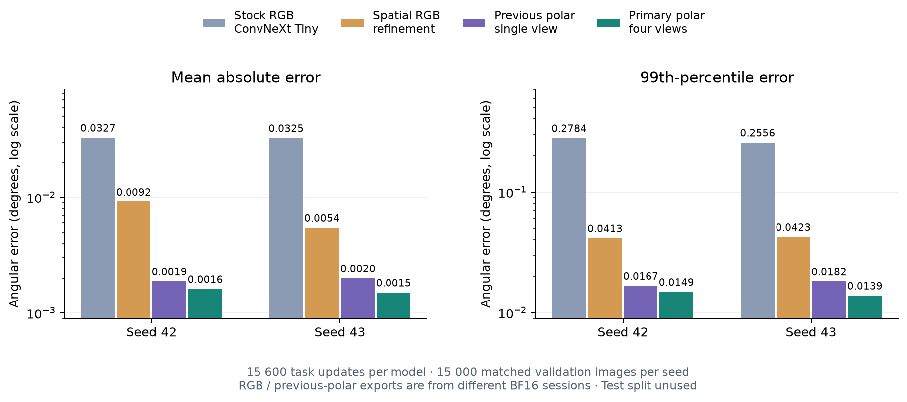
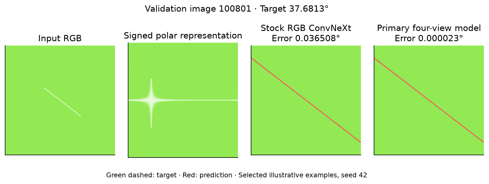
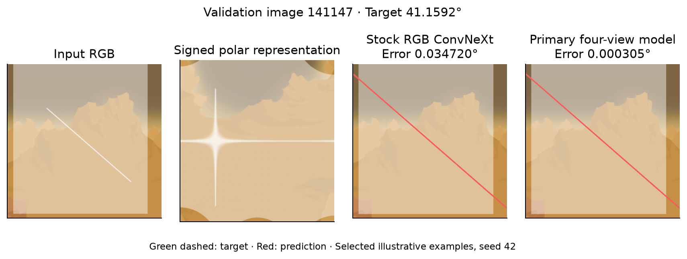
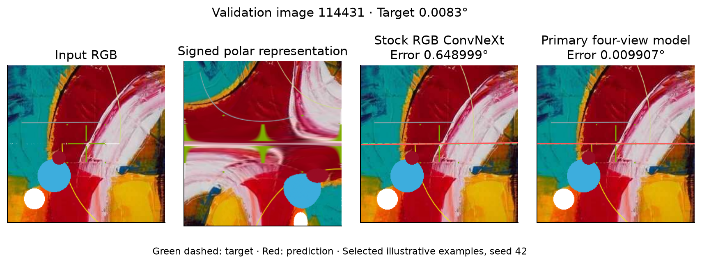
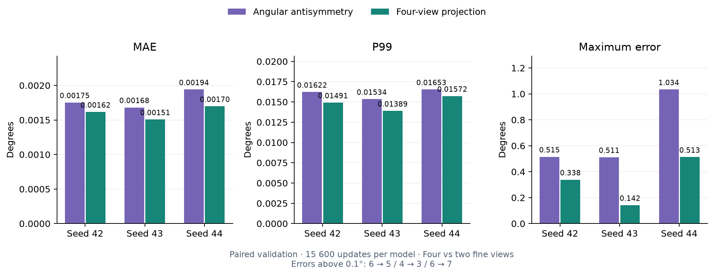
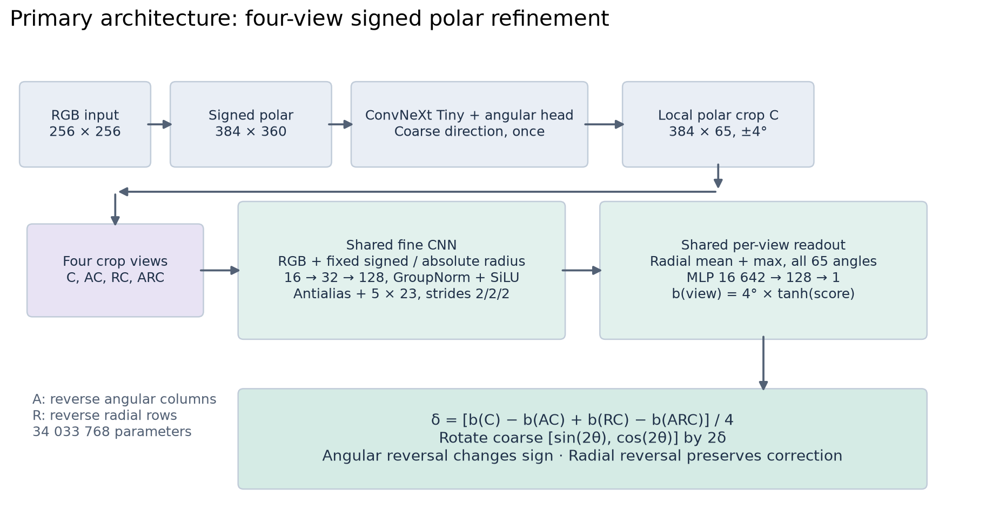

# Angle-Predictor

[English](README.md) · [Русский](README.ru.md)

Angle-Predictor определяет угол тонкой линии, проходящей через центр изображения
с отвлекающими объектами. Модель использует полярные координаты со знаковым
радиусом, ConvNeXt Tiny для первоначальной оценки и локальную CNN для её уточнения.

Основная модель V2 использует четыре представления локального полярного кропа
с общими весами. Её **MAE на валидации составляет 0,001615°, 0,001506° и
0,001698°** для seed 42, 43 и 44. При одинаковом бюджете в 15 600 шагов
MAE ниже на **95,06% и 95,36%** относительно стандартного ConvNeXt Tiny
на RGB-изображениях для seed 42 и 43.

## Результаты

Каждая модель получила **15 600 шагов обучения на целевой задаче**, включая
обучение использованных исходных весов. В каждой ячейке указаны seed 42 / 43.
Модели проверены на одинаковых 15 000 валидационных изображений внутри каждого
seed. Все ошибки приведены в градусах. MAE означает среднюю абсолютную ошибку
угла, P99 показывает границу, ниже которой находятся 99% ошибок.

| Модель | MAE ↓ | P99 ↓ | Максимум ↓ |
| --- | ---: | ---: | ---: |
| Чистый ConvNeXt Tiny на RGB | 0,032679 / 0,032459 | 0,278369 / 0,255570 | 2,702152 / 4,141962 |
| Пространственная голова и локальное уточнение на RGB | 0,009159 / 0,005435 | 0,041323 / 0,042328 | 60,444824 / 3,282609 |
| Предыдущая полярная модель с одним представлением | 0,001880 / 0,001997 | 0,016748 / 0,018200 | 0,426159 / 1,050881 |
| **Основная четырёхвидовая полярная модель** | **0,001615 / 0,001506** | **0,014910 / 0,013887** | **0,338185 / 0,141791** |

Первый вариант сохраняет стандартную архитектуру ConvNeXt, кроме двух выходов
для угла. Второй добавляет пространственную голову и локальное уточнение
в декартовых координатах без полярного преобразования. Основная модель
снижает P99 на **94,64% и 94,57%** относительно чистого ConvNeXt. Модели
проверены на одинаковых изображениях внутри каждого seed, в разных BF16-сессиях.
Сравнение оценивает полные алгоритмы при одинаковом числе шагов обучения.
Вычислительные затраты различаются, а полярное преобразование является
одним из нескольких изменений.

Чтобы измерить эффект последнего изменения, к голове с угловой антисимметрией
добавили радиальное отражение. Обе модели проверены в одной сессии
на 15 000 изображений для каждого seed.

| Seed | MAE угловой → четырёхвидовой (°) | Снижение MAE | P99 угловой → четырёхвидовой (°) | Снижение P99 |
| --- | ---: | ---: | ---: | ---: |
| 42 | 0,001753 → 0,001615 | 7,83% | 0,016220 → 0,014910 | 8,08% |
| 43 | 0,001681 → 0,001506 | 10,43% | 0,015343 → 0,013887 | 9,49% |
| 44 | 0,001941 → 0,001698 | 12,53% | 0,016531 → 0,015720 | 4,91% |

Максимальная ошибка четырёхвидовой модели на seed 44 составляет 0,512762°,
у предыдущей V1 она равна 0,414949°. Улучшение MAE и P99 не означает,
что каждый редкий случай стал лучше. [Отчёт по трём seed](docs/reports/four-view-refinement/README.md)
содержит максимумы, сложные подгруппы и независимые проверки BF16/FP32.



[Отчёт о сравнении RGB и полярной модели](docs/reports/cartesian-comparison/README.md)
содержит кривые обучения, сложные подгруппы, крупные ошибки и вычислительные затраты.

## Примеры предсказаний

На примерах из валидации показаны исходное изображение, полярное представление
и предсказания чистого ConvNeXt и четырёхвидовой модели. Это те же три изображения,
что и в предыдущем сравнении с RGB. Зелёный пунктир обозначает истинное
направление, красная линия показывает предсказание. Подписи позволяют сравнить
ошибки, которые слишком малы, чтобы различить их визуально.







## Что изменилось в ходе исследования

Исходной моделью была ConvNeXt Tiny с инициализацией ImageNet, работающая
с полярным изображением. После настройки её MAE составила 0,010441° и
0,010615° за 5 200 шагов. Для исследования был создан генератор синтетических
данных, затем проведены сравнения представлений угла, функций потерь и
оптимизаторов. Первоначальный поиск архитектуры включал 121 завершённый запуск.
Дальнейшие эксперименты были направлены на локальную геометрию и симметрии.

Более компактные backbone и сокращённые варианты Tiny уменьшали вычисления,
но не сохраняли точность при проверенном режиме обучения. Анализ ошибок
выявил две разные задачи: выбрать нужную линию среди отвлекающих объектов
и точно измерить её угол. Локальная ветвь уточнения улучшила вторую задачу,
а Tiny сохранилась для первой.

Каждый вариант ветви уточнения сравнивался с исходной для него моделью
при одинаковом числе шагов обучения.

| Изменение | Зачем проверялось | Снижение MAE, seed 42 / 43 |
| --- | --- | ---: |
| 384 радиальных отсчёта в кропе вместо 192 | Сохранить детали слабых и прерывистых отрезков | 12,03% / 7,16% |
| Увеличение последнего слоя fine с 32 до 64 каналов | Повысить ёмкость локального энкодера | 7,41% / 9,36% |
| Фильтрация перед уменьшением радиального разрешения | Уменьшить чувствительность к расположению отсчётов | 5,74% / 6,20% |
| 65 угловых отсчётов с пропорционально более широким ядром | Сохранить малые угловые смещения и охват контекста | 20,79% / 16,01% |
| Увеличение последнего слоя fine с 64 до 128 каналов после одинакового продолжения обучения | Улучшить локальное представление и расчёт поправки | 4,63% / 3,09% |
| Угловая антисимметрия | Менять знак поправки при отражении угловых столбцов | 6,77% / 15,84% |
| Радиальное отражение вместе с угловой антисимметрией | Сохранять поправку при смене направления знакового радиуса | 7,83% / 10,43% |

Первые четыре строки относятся к бюджету 10 400 шагов, остальные к 15 600.
Это отдельные сравнения, поэтому проценты нельзя складывать.
Три угловые свёртки с ядрами по 23 отсчёта дают рецептивное поле в 67 отсчётов,
охватывающее окно уточнения из 65 столбцов.
Увеличенные радиальные ядра, дополнительные интервалы pooling, более плотная
радиальная карта последнего слоя и альтернативные головы регрессии
не дали устойчивого дальнейшего улучшения.



Предыдущие эксперименты определили режим обучения. Vector Charbonnier
снизила среднюю ошибку на **25,4% относительно MSE по десяти seed**.
MuSGD показал наименьшую медианную ошибку среди трёх семейств оптимизаторов
в проверенном поиске гиперпараметров. Последующая настройка learning rate
и weight decay дала базовую Tiny для архитектурных сравнений.

## Зачем нужны полярные координаты

В исходном изображении изменение угла линии меняет её наклон относительно
обеих пиксельных осей. При малом повороте пиксели у концов смещаются сильнее,
чем у центра. Чтобы измерить очень небольшую угловую разницу, модель должна
объединить признаки из удалённых участков отрезка.

Полярное преобразование упорядочивает эти признаки относительно известного
центра изображения. Каждый столбец соответствует одному направлению,
а каждая строка расстоянию вдоль этого направления:

```text
P(r, θ) = I(cx + r cos θ, cy + r sin θ)
```

Здесь `I` обозначает RGB-изображение, а `(cx, cy)` его центр. Радиус `r`
принимает отрицательные и положительные значения, поэтому один столбец
проходит по целому диаметру через центр. Углы охватывают диапазон от 0°
до 180°. Знаковый радиус позволяет представить обе половины ненаправленной
линии без отдельного изображения на 360°. Преобразование использует
наибольшую окружность внутри входного квадрата, оставляя углы квадрата
за пределами представления.

Линия через центр превращается в узкую полосу вдоль радиальной оси
в позиции своего угла. Например, линия под 30° появляется рядом со столбцом
30°. Поворот до 31° смещает её отклик по угловой оси, вместо появления нового
диагонального рисунка. На входе из 360 столбцов такой поворот соответствует
двум столбцам. Толщина линии и интерполяция распределяют отклик между
соседними столбцами.

Радиальный pooling объединяет признаки из разных частей отрезка, сохраняя
угловую позицию. Видимые участки помогают оценить угол, даже если другие части
линии слабо различимы или перекрыты.

После первоначальной оценки ветвь уточнения выбирает узкое окно ±4° по всему
радиальному диапазону. Её CNN уменьшает разрешение по радиусу, сохраняя угловые
столбцы, чтобы близкие направления оставались различимыми. Затем голова
регрессии оценивает непрерывную поправку.

Шаг угловой сетки глобального изображения составляет 0,5°.
Локальное окно содержит 65 интерполированных отсчётов на диапазоне 8°,
что даёт шаг 0,125°. Это интервалы выборки, а не ограничения результата
регрессии. Билинейная выборка и непрерывная поправка позволяют оценивать
смещения меньше одного столбца, но интерполяция не добавляет новых деталей
в исходное изображение.

Эта геометрия предполагает прохождение целевой линии через центр.
Смещённая линия превращается в кривую, а отвлекающие объекты могут создавать
конкурирующие отклики. Полярные координаты упорядочивают признаки,
а обучаемая ветвь coarse выбирает нужную линию.

## Финальная архитектура



Ненаправленная линия имеет одинаковую ориентацию при θ и θ + 180°.
Модель предсказывает **[sin(2θ), cos(2θ)]**, избегая разрыва на этой границе.
RGB-изображение размером 256 × 256 преобразуется в полярное изображение
**384 × 360 со знаковым радиусом** относительно центра. Линия через центр
выстраивается вдоль радиального измерения.

ConvNeXt Tiny и собственная голова регрессии угла дают первичную оценку (coarse).
Ветвь уточнения (fine) выбирает исходные полярные пиксели в **кроп 384 × 65 с окном ±4°**
вокруг этой оценки. При переходе через границу 0°/180° радиальная ось
отражается согласно `P(r, θ + π) = P(−r, θ)`.

| Компонент | Устройство |
| --- | --- |
| Первичная оценка | Полная ConvNeXt Tiny с угловой головой на основе attention |
| Вход fine | RGB, знаковая и абсолютная радиальные координаты |
| Энкодер fine | Три блока CNN с GroupNorm и SiLU, 16 → 32 → 128 каналов |
| Представления с общими весами | Исходный кроп, угловое отражение, радиальное отражение и оба отражения |
| Уменьшение разрешения | Фиксированный радиальный фильтр, затем свёртки 5 × 23 с шагом 2 × 1 |
| Агрегация | Среднее и максимум по радиусу с сохранением всех угловых позиций |
| Голова поправки | MLP 16 642 → 128 → 1 с учётом вектора coarse |
| Поправка одного представления | b(C) = 4° × tanh(z(C)), общие CNN и MLP |
| Выход | δ = [b(C) − b(AC) + b(RC) − b(ARC)] / 4, применяется к вектору coarse |
| Параметры | 34 033 768, на 22,33% больше стандартной ConvNeXt Tiny на RGB |

Здесь A отражает угловые столбцы, R отражает радиальные строки. При фиксированном
coarse итоговая поправка меняет знак при A и сохраняется при R. Coarse запускается
один раз, четыре fine-представления используют общие веса. Поэтому четыре
представления не добавляют параметров по сравнению с одним. Эти локальные
ограничения не означают глобальной эквивариантности к повороту изображения.

Ветвь fine измеряет угол по подробному полярному изображению, а не по сжатой
карте признаков backbone.

## Обучение и оценка

Обучение состоит из трёх этапов по 5 200 шагов:

1. Обучение backbone и головы coarse с инициализацией ImageNet
2. Заморозка coarse и обучение новой ветви уточнения
3. Продолжение обучения только fine из полных весов предыдущего этапа

Каждый запуск заново инициализирует MuSGD и использует 200 шагов warmup,
затем косинусное снижение learning rate. Суммарно это **15 600 обновлений**.
Coarse остаётся в режиме evaluation на обоих этапах fine. Для всех трёх seed
проверена неизменность всех 193 тензоров параметров coarse. Вычисления CNN
используют BF16, а выборка пикселей, головы регрессии и расчёт итогового
угла используют FP32.

Датасет `synthetic_lines_150k` содержит 150 000 изображений с целевыми
отрезками, отвлекающей геометрией, фоновыми слоями, перекрытиями
и шумом. Каждый seed задаёт разбиение на 120 000 / 15 000 / 15 000
изображений для обучения, валидации и тестирования. В сравнении совпадают
индексы валидации внутри каждого seed и сохраняются данные, метки, функция
потерь, оптимизатор, аугментации и нормализация. Независимая тестовая выборка
не использовалась при выборе модели.

На RTX 5070 задержка основной модели для одного изображения составила
**14,34 / 14,57 / 14,84 мс** для seed 42 / 43 / 44. У варианта только с угловой
антисимметрией в тех же сессиях получено 14,17 / 14,49 / 14,82 мс.
Это медианы PyTorch BF16 с учётом предобработки. Входные данные уже находятся
на GPU, поэтому загрузка изображения и передача на GPU не включены.
Небольшие различия могут быть шумом измерения.

Свёртки и линейные слои требуют около **39,90 GFLOPs на изображение**,
у предыдущей полярной модели с одним представлением было 28,17. Рост составляет
41,6%. Умножение и сложение считаются отдельно. Активации, редукции и выборка
пикселей не включены. Четыре представления увеличивают вычислительную работу,
даже если задержка одного изображения на GPU меняется мало.

## Отчёты и измерения

| Исследование | Содержание |
| --- | --- |
| [Выбранная модель на трёх seed](docs/reports/four-view-refinement/README.md) | Четыре представления, парные сравнения, редкие крупные ошибки и численные проверки |
| [RGB и полярная модель](docs/reports/cartesian-comparison/README.md) | Чистый ConvNeXt, декартово уточнение, одинаковые бюджеты и примеры предсказаний |
| [Первоначальный поиск архитектуры](docs/reports/architecture-search/README.md) | Сравнения при равном бюджете, устройство модели, сложные случаи и задержка |
| [Сравнение backbone](docs/reports/backbone-comparison/README.md) | Компактные backbone, локальное уточнение и ошибки выбора линии |
| [Совместное дообучение и общие признаки](docs/reports/end-to-end-comparison/README.md) | Последовательное обучение, совместное продолжение и объединение признаков разных масштабов |
| [PolarLine](docs/reports/polar-line-architecture/README.md) | Значительно меньшая модель с компромиссом между точностью и скоростью |
| [Сравнение функций потерь](docs/reports/loss-function-comparison/README.md) | Пять функций, десять совпадающих seed и парные различия |
| [Сравнение оптимизаторов](docs/reports/optimizer-comparison-seed42-43/README.md) | Три семейства оптимизаторов и 60 завершённых запусков |
| [Настройка MuSGD](docs/reports/musgd-tuning-seed42-43/README.md) | Шестнадцать конфигураций, повторённых на двух seed |
| [Скорость аугментаций](docs/augmentation-speed.md) | Измерения preprocessing на GPU и загрузки данных |

[Таблица архитектурных результатов](docs/reports/architecture-search/data/results.csv)
и [исторические измерения V1](docs/reports/architecture-search/data/selected-model.json)
сохраняют результаты первоначального поиска. В [selection.json](configs/final/selection.json)
записаны идентификаторы трёх завершённых запусков, хеши весов и метрики.
По умолчанию используются веса seed 42.
Подробные отчёты написаны на английском языке.

## Запуск проекта

Необходимы Python 3.14 и uv. Группа зависимостей для обучения устанавливает
PyTorch с поддержкой CUDA на Windows и Linux.

```sh
uv sync --locked
docker compose -f infra/mlflow/compose.yaml up -d
uv run angle-train run --config configs/final/coarse.yaml
```

Для обучения нужен локальный датасет с файлами `images.dat`, `labels.dat`
и `meta.json` по настроенному пути. Файлы датасета, checkpoints и визуальные
ресурсы генератора исключены из Git. Код генератора включён в проект,
но для воспроизведения точного распределения изображений необходимы
исходные локальные ресурсы.

Три [конфигурации финальной модели](configs/final/README.md) описывают этапы
coarse, нового fine и продолжения fine. Обучению fine нужны checkpoint
предыдущего этапа и его фактический идентификатор запуска. При загрузке
проверяются разбиение данных, fingerprint датасета, preprocessing
и архитектура.

В [релизе](https://github.com/aidiors/Angle-Predictor/releases/tag/v0.2.0)
доступны обе версии:

- [Веса V2](https://github.com/aidiors/Angle-Predictor/releases/download/v0.2.0/angle-predictor-v2.pt): основная модель с четырьмя представлениями
- [Веса V1](https://github.com/aidiors/Angle-Predictor/releases/download/v0.2.0/angle-predictor-v1.pt): предыдущая модель с одним представлением

Оба файла содержат полные веса seed 42, параметры предобработки и архитектуры.
Для инференса не нужны датасет или checkpoints предыдущих этапов.
В релиз включены контрольные суммы SHA-256. По умолчанию используйте V2:

```sh
uv run angle-predict --checkpoint angle-predictor-v2.pt --input image.png --device cuda
```

[Инструменты измерений](benchmarks/README.md) считают операции, сравнивают
checkpoints на валидации и строят актуальные графики по сохранённым данным.

Также доступен инференс на CPU. Входное изображение должно быть RGB
размером 256 × 256 с целевой линией через центр.

```sh
uv sync --locked --all-groups
uv run ruff check .
uv run ruff format --check .
uv run ty check src benchmarks --extra-search-path .
uv run python -m unittest discover -s tests
```

## Ограничения

Эти результаты получены на синтетических валидационных изображениях.
Архитектуру выбирали по валидации, поэтому сравнение на трёх seed не заменяет
независимый тест. Качество на реальных изображениях тоже нужно проверить отдельно.

Уточнение ограничено диапазоном ±4° и не может надёжно исправить оценку
coarse, выбравшую другую линию. Очень слабые линии и направления около
полярной границы остаются сложными. Финальная модель улучшает типичную
точность, но предыдущая V1 имеет меньший максимум на seed 44.

## Лицензия

Код проекта распространяется под [Apache License 2.0](LICENSE).
