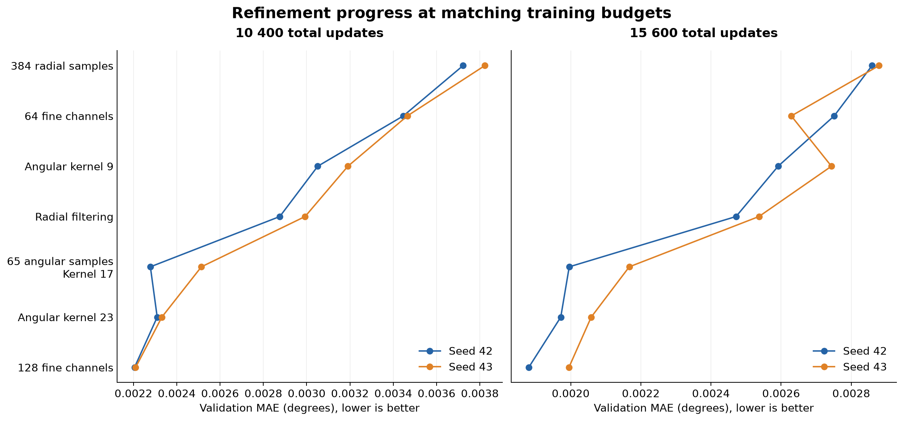
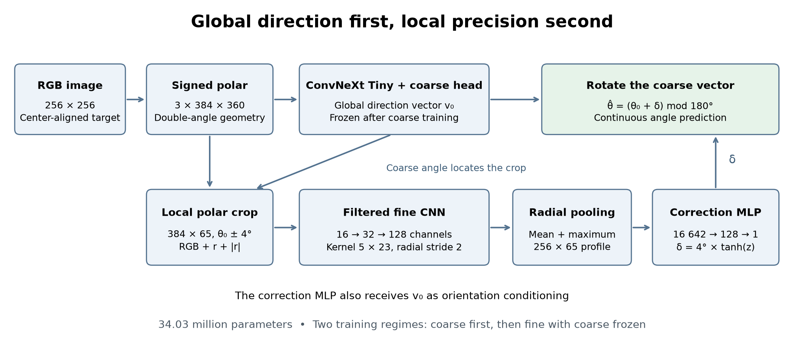
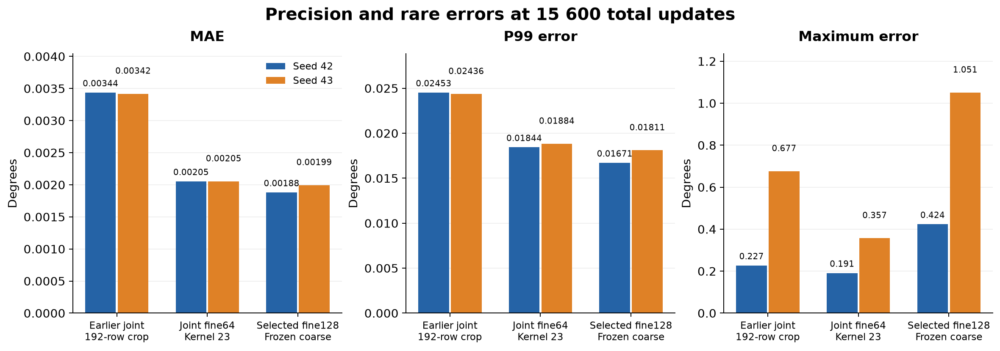

# Architecture search: from global regression to local refinement

The strongest model in this search combines a full ConvNeXt Tiny backbone with
a separately trained local refinement branch. It estimates the line direction
globally, then measures a small correction from a detailed polar crop.
The selected model reached **0.001880° and 0.001995° validation MAE** on two
seeds, with **0.016715° and 0.018106° P99 error**.

At the same total training budget, this reduced MAE by **45.29% and 41.66%**
relative to the earlier coarse → fine → joint model. The choice prioritizes
average accuracy and P99. A smaller refinement model with joint fine-tuning
produced lower maximum errors, so it remains an alternative when rare large
mistakes matter more than typical precision.

## Task and comparison method

The task is to estimate the orientation of a finite, undirected line passing
through the center of a 256 × 256 RGB image. The `synthetic_lines_150k` dataset
contains 150 000 images with distracting lines, arcs, background layers,
occlusions and noise. Some target lines have very little visible contrast.

Each seed uses a deterministic split of 120 000 training images, 15 000
validation images and 15 000 test images. Seeds 42 and 43 change both the data
partition and training randomness. Comparisons therefore use the corresponding
baseline and identical validation indices within each seed. The test split was
not used for architecture selection.

Angular error is the shortest distance between the predicted and target
orientations modulo 180°. MAE averages these errors. P99 is their 99th
percentile, describing the error below which 99% of validation predictions fall.

The wider search includes 113 completed training runs across backbone,
pruning and refinement studies. The extended refinement search contains 42
complete pairs and one completed run from an unfinished pair. The unfinished
pair is excluded from the final ranking.

Architecture controls retained the data, renderer, labels, augmentation,
preprocessing, Vector Charbonnier loss and MuSGD optimizer. Separate learning
rate schedule experiments are treated as optimization experiments rather than
evidence for an architectural improvement. Every started training run used its
full declared budget. The best validation checkpoint was retained.

Training cost is measured as the total number of task updates in a model's
checkpoint ancestry. A coarse model trained for 5 200 steps followed by a
5 200-step refinement stage costs 10 400 steps. A further 5 200-step continuation
costs 15 600. Reusing a full checkpoint does not count its embedded coarse model
twice. ImageNet pretraining is shared initialization and is outside this task
budget.

## What the search established

### A smaller global backbone did not preserve accuracy

Fifteen pruning configurations tested shorter ConvNeXt stages and smaller
regression heads. None met both criteria of preserving baseline MAE and
improving single-image inference latency by at least 5% on seed 42.

The smaller 128-feature head reduced parameters from 31.36 million to
29.44 million and retained MAE, at 0.010365° versus 0.010441°. Its measured
latency was 10.889 ms versus 10.848 ms, which provided no speed improvement.
The fastest tested reduction reached 9.134 ms versus its paired baseline's
11.014 ms, but MAE rose to 0.014100°. These candidates did not advance to a
confirming second seed.

The [backbone study](../backbone-comparison/README.md) also found that
MobileNetV4, FasterNet, EfficientNetV2 and ConvNeXt V2 Nano did not match Tiny
under the fixed training recipe. Nano's large direction errors on the second
seed sometimes placed the target outside the local ±4° refinement window.
The full Tiny backbone remained the coarse estimator.

A shared backbone was another way to reduce computation. Increasing its
fusion width from 64 to 256 improved both seeds relative to the narrower
version, but it beat standalone Tiny on only one seed. Enlarging the shared
head's angular receptive field did not produce a consistent gain.

### Sequential training was more reliable than fresh joint training

Training all coarse and fine weights together from ImageNet initialization
for 15 600 steps produced MAE of 0.006239° and 0.007074°. The earlier sequential
coarse → frozen fine → joint model achieved 0.003437° and 0.003419° at the same
total budget, with smaller P99 and maximum errors.

Heatmap correction, removal of the coarse vector from the correction MLP and
detaching the crop angle from the coarse gradients did not establish a paired
advantage. Longer standalone Tiny training also failed to reach the precision
of local refinement. These results support sequential training under the
tested recipe. They do not establish a general limit on end-to-end learning.

A separate control distinguished the effect of more fine updates from the
effect of unfreezing coarse weights. Continuing the original frozen fine
branch for another 5 200 steps reached 0.003441° and 0.003416°, close to the
earlier joint model. Joint training still had smaller P99 and maximum errors.
Much of the mean improvement could therefore be obtained through additional
fine training, while unfreezing changed the error distribution.

### Preserving detail and angular context improved refinement

The next experiments kept the coarse model fixed and changed how the local
branch represented the line. Each row below compares against its matching
parent at the same total training budget.

| Change | Total steps | MAE improvement, seed 42 / 43 |
| --- | ---: | ---: |
| Preserve all 384 radial samples instead of cropping to 192 | 10 400 | 12.03% / 7.16% |
| Increase the last fine layer from 32 to 64 channels | 10 400 | 7.41% / 9.36% |
| Increase the angular kernel from 5 to 9 samples | 10 400 | 11.46% / 7.92% |
| Filter radially before each downsampling convolution | 10 400 | 5.74% / 6.20% |
| Increase angular sampling from 33 to 65 and kernel size from 9 to 17 | 10 400 | 20.79% / 16.01% |
| Increase the angular kernel from 17 to 23 on the 65-sample crop | 15 600 | 1.21% / 5.01% |
| Increase the last fine layer from 64 to 128 channels | 10 400 | 4.54% / 5.20% |
| Compare the same 64 → 128 change after matched continuation | 15 600 | 4.63% / 3.09% |

The denser angular crop experiment maintained the same nominal physical
receptive field by increasing the kernel size with the sampling density.
The later 23-sample kernel covered the full local window. Its initial
10 400-step result was mixed, and its continuation improvement on seed 42 had
a bootstrap interval crossing zero. The final width increase had stronger
evidence, improving MAE, P99 and ordinary errors on both seeds.

These percentages are separate comparisons and cannot be added together.
Some changes also affect multiple properties. Increasing the fine width
enlarges both the CNN and the MLP input projection. Radial filtering changes
the effective receptive field as well as smoothing the signal.

Several plausible alternatives failed to retain their early gains.
Splitting radial pooling into two bins lost to global pooling after matched
continuation. A larger radial kernel without the fixed filter was less
accurate than the filtered design. Keeping a denser final radial feature map
did not improve MAE on both seeds and worsened P99 and maximum error on both.
Reducing the correction MLP from 128 to 64 hidden features lost accuracy,
while increasing it to 256 in an earlier encoder did not give a paired gain.



## Final architecture



### Signed polar coordinates

An undirected line has the same orientation at θ and θ + 180°. Labels and
predictions use the vector **[sin(2θ), cos(2θ)]**, avoiding a discontinuity
between 0° and 180°. Decoding uses half the vector's `atan2` angle, modulo π.
In image coordinates, x points right and y points down, so positive angles
rotate clockwise from a horizontal line.

The input is resampled into a **384 × 360 signed polar image**. Radius spans
both sides of the center, from −127.5 to 127.5 pixels, and the angular axis
covers 180° at 0.5° spacing. Bilinear sampling is followed by RGB normalization
to [−1, 1]. A line through the center becomes a structure aligned along the
radial axis, making it easier to combine evidence from separated visible
segments.

### Global direction estimator

The coarse model uses the complete ImageNet-initialized ConvNeXt Tiny.
Its final feature map has shape 768 × 12 × 11. The custom regression head
combines radial mean, radial maximum and learned radial attention pooling.
Double-angle positional features and three circular angular convolutions
provide orientation context. Angular attention then aggregates the features.
A residual MLP with 256 hidden features, LayerNorm, GELU and dropout produces
the normalized two-component direction vector.

The coarse model has 31 363 687 parameters. After its first training stage,
the backbone and head remain frozen and in evaluation mode throughout fine
training. Recorded checkpoint comparisons confirmed that all 193 coarse
parameter tensors were unchanged on both seeds.

### Local crop and seam handling

The predicted coarse angle θ₀ locates a **384 × 65 crop spanning θ₀ ± 4°** in
the original polar RGB tensor. Fine features are sampled from this detailed
representation rather than from the downsampled backbone features.

The crop's angular pitch is 0.125°. This is denser interpolation of the
original 0.5° polar grid, not additional source pixels. At the 0°/180° seam,
the sampler uses `P(r, θ + π) = P(−r, θ)`. Wrapping the angle therefore also
reflects the radial axis. A simple circular repeat of the columns would
misalign the two halves of the line.

Two coordinate channels, signed radius r and absolute radius |r|, accompany
RGB. The fine encoder receives five channels and can distinguish the center
from the outer parts of the crop.

### Fine encoder and continuous correction

Each of the three fine blocks applies a fixed radial filter `[1, 2, 1] / 4`
with replicate padding, followed by a 5 × 23 convolution, GroupNorm and SiLU.
Radial stride is 2 in each block. Angular stride remains 1.

| Layer | Output shape, excluding batch |
| --- | --- |
| RGB crop and radial coordinates | 5 × 384 × 65 |
| Filter, convolution and normalization | 16 × 192 × 65 |
| Filter, convolution and normalization | 32 × 96 × 65 |
| Filter, convolution and normalization | 128 × 48 × 65 |
| Concatenated radial mean and maximum | 256 × 65 |
| Flattened profile and coarse vector | 16 642 |
| Correction MLP | 16 642 → 128 → 1 |

Radial pooling combines distributed evidence while retaining strong local
responses. It preserves all 65 angular positions, allowing the correction
head to identify where the line falls within the crop. The three angular
convolutions have a nominal receptive field of 67 samples, enough to cover
the entire 8° window. Their boundary padding is zero rather than circular.

The MLP receives the pooled profile and the coarse double-angle vector.
Its scalar output z becomes a bounded correction `δ = 4° × tanh(z)`.
The final direction vector is rotated by twice this correction:

```text
ŝ = s₀ cos(2δ) + c₀ sin(2δ)
ĉ = c₀ cos(2δ) − s₀ sin(2δ)
θ̂ = (θ₀ + δ) mod 180°
```

The correction is continuous, so it is not restricted to the crop's angular
grid positions. A newly initialized fine branch starts with a zero final
linear layer and exactly reproduces the coarse prediction before learning.
The CNN uses BF16, while sampling, radial reductions, regression heads and
final angle geometry use FP32.

Fine refinement adds 2 670 081 parameters. The full predictor has
**34 033 768 parameters**, an 8.51% increase over standalone coarse.
Inference requires only the RGB image and the complete model checkpoint.

## Training the selected model

The model uses two training regimes across three runs. The last run continues
fine training and does not unfreeze the coarse weights.

| Stage | Initialization | Trainable weights | New steps | Total steps |
| --- | --- | --- | ---: | ---: |
| Coarse estimation | ImageNet backbone and a new regression head | Backbone and coarse head | 5 200 | 5 200 |
| Fresh refinement | The same seed's coarse checkpoint and a new fine branch | Fine CNN and correction MLP | 5 200 | 10 400 |
| Refinement continuation | The same seed's complete preceding checkpoint | Fine CNN and correction MLP | 5 200 | 15 600 |

Each run resets the optimizer and learning rate schedule. The two fine runs
are separate 5 200-step cycles, not a single 10 400-step cosine schedule.
All selected checkpoints in both final ancestry chains came from the last
step of their respective runs.

| Setting | Value |
| --- | --- |
| Batch size | 32 |
| Loss | Vector Charbonnier, ε = 0.1 |
| Optimizer | MuSGD |
| Learning rate | Approximately 0.000798 |
| Weight decay | Approximately 0.01012, excluding bias and normalization groups |
| Momentum | 0.95 with Nesterov |
| Matrix and convolution update factors | Muon 0.7, SGD 0.3 |
| Schedule per run | 200 warmup steps, then 5 000 cosine steps to 10⁻⁸ |
| Gradient clipping | Norm 1.0 |
| Validation | Every 1 300 steps |

The loss is computed on the final double-angle vector. Refinement receives
no separate ground-truth residual target or auxiliary coarse loss. Its crop
is located by the model's coarse prediction, including during training.
The fixed coarse estimator gives the fine branch a stable local measurement
problem.

Training augmentation includes horizontal and vertical flips with matching
label transformations, brightness and color jitter, Gaussian noise and
speckle. Validation and inference use no augmentation. The loss and optimizer
were selected in earlier studies and remained fixed during architectural
comparisons.

## Results at equal training cost

All models in this table have a total budget of **15 600 task updates**.
Each cell reports seed 42 / seed 43, and all error values are in degrees.

| Model | MAE | P99 | Maximum |
| --- | ---: | ---: | ---: |
| Fresh joint training, original 192-row crop | 0.006239 / 0.007074 | 0.043590 / 0.045649 | 3.353607 / 3.762028 |
| Earlier sequential model with joint continuation, 192-row crop | 0.003437 / 0.003419 | 0.024526 / 0.024363 | 0.227046 / 0.676586 |
| Frozen coarse, 384-row crop, 32 fine channels | 0.002859 / 0.002879 | 0.023186 / 0.022763 | 0.330671 / 0.737857 |
| Frozen coarse, 64 fine channels, 65 angular samples, kernel 17 | 0.001996 / 0.002167 | 0.018231 / 0.018934 | 0.284163 / 1.038987 |
| Frozen coarse, 64 fine channels, 65 angular samples, kernel 23 | 0.001972 / 0.002058 | 0.018069 / 0.018716 | 0.459905 / 1.026583 |
| Joint continuation of the 64-channel, kernel 23 model | 0.002054 / 0.002054 | 0.018441 / 0.018835 | **0.191248 / 0.357315** |
| Selected frozen coarse, 128 fine channels, kernel 23 | **0.001880 / 0.001995** | **0.016715 / 0.018106** | 0.423626 / 1.050872 |



The selected model's median errors are 0.000803° and 0.000807°. P95 is
0.006557° and 0.006737°, while P99.9 is 0.055611° and 0.060295°.
There are 6 and 8 errors above 0.1° among 15 000 validation images.
The joint 64-channel alternative has 4 and 9 such errors. Maximum error and
threshold counts therefore do not produce the same ordering.

The 128-channel model also improves ordinary errors relative to the matching
64-channel model. After removing the union of each model's largest 0.1% of
errors, MAE is 0.001750° and 0.001799°, compared with 0.001817° and 0.001878°.
Using the same surviving indices prevents separate trimming from favoring
one candidate. Descriptive paired bootstrap intervals for the full MAE
difference are negative on both seeds. These intervals describe the observed
validation comparison and do not correct for adaptive model selection.

### Weak lines and difficult orientations

The following table compares the selected model with the earlier sequential
192-row joint model at the same 15 600-step budget.

| Validation group | Earlier MAE, seed 42 / 43 | Selected MAE, seed 42 / 43 |
| --- | ---: | ---: |
| Lowest target-contrast quintile | 0.006913 / 0.006755 | 0.004180 / 0.004510 |
| Low visible target support | 0.011667 / 0.012360 | 0.006903 / 0.009159 |
| Within 2.5° of the 0°/180° seam | 0.011374 / 0.012286 | 0.007269 / 0.009799 |
| Within 2.5° of vertical | 0.008560 / 0.007621 | 0.006215 / 0.005363 |
| Away from both axes | 0.003072 / 0.003008 | 0.001608 / 0.001643 |

Contrast and support are pixel-based proxies measured along the known target
line for analysis. They are not ground-truth line opacity or length and are
not inputs to inference.

Improvements are not universal across comparisons. Against the matching
64-channel frozen model, seam-group MAE on seed 43 rises from 0.009438° to
0.009799°. The selected model's maximum error also exceeds that of the older
192-row joint model on both seeds. Local refinement can make an already good
coarse prediction worse on an individual image.

## Why this design works better

The results favor separating global selection from local measurement.
ConvNeXt Tiny first identifies the correct line among distractors. A fine
branch then works within a small angle window using the original polar
signal. Freezing coarse weights makes that window stable while refinement
learns a much smaller correction.

Preserving radial detail helps retain evidence from faint or interrupted
segments. Filtering before radial downsampling reduces sensitivity to which
feature rows capture those segments. Denser angular interpolation preserves
small positional changes, while a wider angular kernel gives the encoder
enough context to interpret the whole crop. The final width increase provides
more features for the correction head without reducing that context.

This explanation is consistent with the matched comparisons. The search
does not isolate every mechanism, and theoretical receptive field coverage
does not show which pixels the trained network actually uses.

## Supporting results

The [selected model measurements](data/selected-model.json) describe its
architecture, accuracy and computational cost. The
[run inventory](data/results.csv) includes the completed backbone, pruning and
refinement experiments. The [pruning results](data/pruning-results.csv) retain
the accuracy and speed comparisons for the smaller Tiny variants.
The [final paired comparison](data/final-comparison.json) records the matching
training budgets, ordinary errors and difficult image groups.

The related [polar representation study](../polar-line-architecture/README.md),
[backbone comparison](../backbone-comparison/README.md) and
[initial joint/shared comparison](../end-to-end-comparison/README.md) describe
the earlier foundations of the search.
