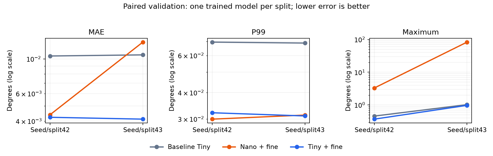
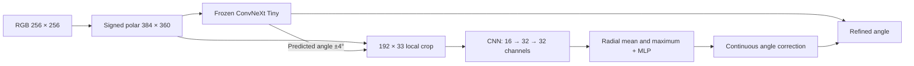

# Backbone selection and local angle refinement

The most accurate model in this comparison kept ConvNeXt Tiny and added a
small local refinement branch. It reached **0.004231° and 0.004117° validation
MAE** on two seeds, compared with 0.010441° and 0.010615° for standalone Tiny.
The smaller backbones did not preserve its accuracy under the tested recipe.

Refinement added less than 1% to the parameter count, but also received an
extra training stage. The result establishes the accuracy of the two-stage
system rather than an architectural gain at equal total training cost.

## Task and comparison method

The task is to estimate the orientation of an undirected line passing
through the center of a 256 × 256 RGB image. The `synthetic_lines_150k`
dataset contains 150 000 images with distracting geometry, background
layers, occlusion and noise. Each seed uses 120 000 training images,
15 000 validation images and 15 000 test images. The test split was not used.

Nine additional training runs compared four pretrained backbone families
and local refinement on Nano and Tiny. Standalone models used the same
384 × 360 signed-polar representation, regression head with 256 hidden
features, Vector Charbonnier loss with ε = 0.1, MuSGD, augmentations,
batch size 32, BF16 and 5 200 steps.

MobileNetV4 and FasterNet offered compact convolutional designs.
EfficientNetV2-RW-T provided an alternative based on MBConv and Fused-MBConv.
ConvNeXt V2 Nano tested a smaller model from a closely related family.
Each backbone passed its final feature stage to the same head design,
with an input channel count matching its features.

Seeds 42 and 43 used their own trained models and data partitions.
All comparisons within a seed used the same validation images.
A two-stage model first trained coarse for 5 200 steps, then trained only
its new refinement branch for another 5 200, giving 10 400 total steps.

## Backbone results

| Model | MAE, seed 42 (°) | MAE, seed 43 (°) | Parameters | Total steps |
| --- | ---: | ---: | ---: | ---: |
| ConvNeXt Tiny | 0.010441 | 0.010615 | 31 363 687 | 5 200 |
| MobileNetV4 Conv Medium | 0.034155 | Not measured | 11 485 719 | 5 200 |
| FasterNet-T2 | 0.115662 | Not measured | 16 263 943 | 5 200 |
| EfficientNetV2-RW-T | 0.053386 | Not measured | 13 803 483 | 5 200 |
| ConvNeXt V2 Nano | 0.014632 | 0.027014 | 18 034 967 | 5 200 |
| Nano with local refinement | 0.004394 | 0.012811 | 18 346 456 | 10 400 |
| **Tiny with local refinement** | **0.004231** | **0.004117** | 31 675 176 | 10 400 |

MobileNetV4 and FasterNet processed a batch of 32 faster than Tiny, but
substantially increased MAE. EfficientNetV2-RW-T was slower in the recorded
measurements. Nano came closest among the replacements, although its second
seed exposed large mistakes. Results measured on only one seed remain
exploratory and do not establish repeatability.

Angular error is the shortest distance between orientations modulo 180°.
MAE averages these errors. P99 is the threshold below which 99% of validation
errors fall. A low MAE can coexist with a small number of severe mistakes.

## Why local refinement was tested

Baseline error analysis suggested that a substantial gain required better
ordinary predictions as well as fewer outliers. On seed 42, the worst 1% of
images contributed 12.18% of total absolute error. Even perfect correction
of those images alone would leave MAE at approximately 0.00917°.

Errors were also concentrated near the polar-map seam and on weak lines.

| Baseline group, seed 42 | Images | MAE (°) |
| --- | ---: | ---: |
| Within 2.5° of the 0°/180° seam | 390 | 0.029885 |
| Within 2.5° of vertical | 408 | 0.020015 |
| Away from both axes | 14 202 | 0.009632 |
| Lowest target-contrast quintile | 3 000 | 0.016967 |

The lowest-contrast quintile contained 46 of the 64 errors above 0.1°.
Contrast was estimated from pixels along the known target direction and
neighboring traces. This is a diagnostic proxy, not an exact measurement of
line length or opacity, and it is not an input to inference.

A separate numerical check found loss of precision in the renderer's
float32 coverage calculations near horizontal and vertical orientations.
It did not establish how much of the model error came from that effect.
The renderer and dataset remained fixed during the architecture comparisons.

These observations motivated a model that retained reliable global line
selection while giving precise regression direct access to the polar pixels.

## Local refinement architecture

The coarse model identifies the target direction among distractors.
A 192 × 33 crop from the original polar image covers ±4° around its prediction.
The fine branch therefore sees local pixel detail rather than only the
backbone's compressed features.

At the 0°/180° seam, the crop uses `P(r, θ + π) = P(−r, θ)`.
Angular wrapping must reflect the radial axis to preserve the geometry.
Signed and absolute radial coordinates accompany RGB as two extra channels.

Three convolutional blocks with GroupNorm reduce the radial dimension while
preserving angular positions. Radial mean and maximum features feed an MLP
with 128 hidden features, together with the coarse double-angle vector.
The MLP predicts a bounded correction that rotates this vector.
Its final layer starts at zero, initially reproducing the coarse prediction.

During fine training, coarse remains frozen and in evaluation mode, including
dropout. Fine convolutions use BF16, while crop sampling and angle correction
use FP32. The branch adds **311 489 parameters**, approximately 0.99% of Tiny.
A complete checkpoint contains both branches and requires no labels,
dataset files or separate coarse weights for inference.

## Accuracy and computational cost

| Seed | MAE, Tiny / refined (°) | P99 (°) | Maximum (°) | Errors above 0.1° |
| --- | ---: | ---: | ---: | ---: |
| 42 | 0.010441 / 0.004231 | 0.069431 / 0.032107 | 0.456855 / 0.368420 | 64 / 22 |
| 43 | 0.010615 / 0.004117 | 0.068718 / 0.031002 | 1.022140 / 0.972387 | 62 / 23 |

Tiny refinement improved MAE, P99 and maximum error on both seeds.
The improvements extended to low-contrast lines and difficult orientations.

| Group | Refined MAE, seed 42 / 43 (°) |
| --- | ---: |
| Lowest target-contrast quintile | 0.008805 / 0.008328 |
| Within 2.5° of the seam | 0.014814 / 0.016672 |
| Within 2.5° of vertical | 0.012231 / 0.010809 |

| Seed | Batch 1, Tiny / refined (ms) | Batch 32 (ms) |
| --- | ---: | ---: |
| 42 | 11.41 / 13.28 | 44.15 / 45.91 |
| 43 | 11.58 / 14.36 | 45.89 / 47.97 |

Latency was measured on an RTX 5070 in BF16, including preprocessing with
inputs already on the GPU. Values are medians of 100 repetitions after five
warmup calls. Image loading and transfer to the GPU are excluded.
Refinement added approximately 1.9–2.8 ms to single-image inference.

## Why Nano was not selected

Nano refinement nearly matched Tiny refinement on seed 42. On seed 43,
however, MAE reached 0.012811° despite a median error of only 0.002193°.
Its maximum error was 83.16452°.

Two coarse errors, 46.89° and 83.20°, placed the correct direction outside
the ±4° crop. Even ideal local correction could leave errors of at least
42.89° and 79.20°. These two images alone imply approximately 0.00814° MAE
across the full validation split, before any other errors are counted.

Another difficult image on seed 42 had the correct angle inside the crop,
but refinement moved the prediction slightly farther from it. Scene
reconstruction confirmed a short target near a bright background stripe,
without a central occluder. Crop width alone did not explain that failure.

The analysis separated two problems: choosing the wrong line globally and
measuring its angle inaccurately within a valid crop. A local branch cannot
be expected to solve both. Tiny provided the more reliable global estimator
and was retained for further refinement experiments.

## Outcome and supporting results

This study established local refinement on top of Tiny as a useful direction.
It improved precision on both seeds with a small parameter increase and a
measurable latency cost. The benefit includes additional training, and all
accuracy claims concern synthetic validation data.

The [full results](summary.json), [baseline analysis](baseline_forensics/summary.json),
and refinement analyses for [seed 42](tiny_refinement_seed42/forensics.json)
and [seed 43](tiny_refinement_seed43/forensics.json) retain the measurements.
The [Nano correction bound](coarse43-window-bound.json) and
[recorded failure case](fine-failure-case.json) support the failure analysis.
Examples show [Nano's largest errors](nano_refinement_seed42/worst_candidate.png)
and [regressions from Tiny refinement](tiny_refinement_seed43/worst_regressions.png).

The later [architecture search](../architecture-search/README.md) tests
matching total budgets and develops this initial refinement branch further.
