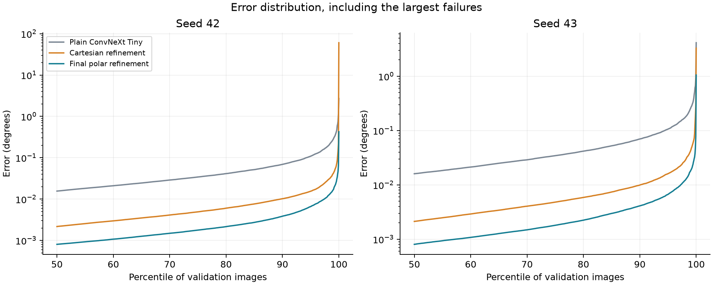
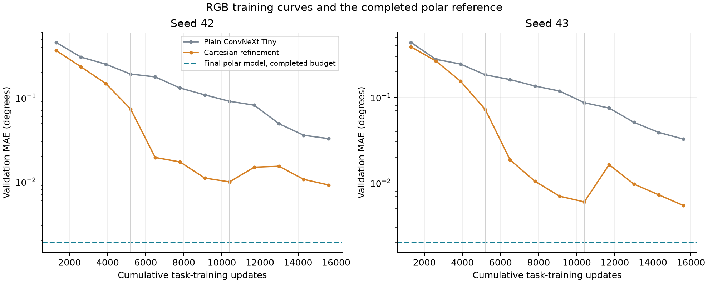

# ConvNeXt on RGB images and polar refinement

The final polar model reduced validation MAE by **94.25% and 93.85%**
relative to a standard ConvNeXt Tiny on RGB images. P99 error fell by
**93.97% and 92.92%**. Both comparisons used 15 600 total
task-training updates and the same 15 000 validation images within each seed.

An additional RGB model tested spatial regression and local refinement without
polar resampling. It substantially improved typical precision, but its bounded
correction could not recover every global line-selection error.

## Method

Eight new training runs covered seeds 42 and 43. Both backbone recipes started
from ImageNet weights. They used the same synthetic dataset, split fractions,
batch size 32, augmentations,
normalization, Vector Charbonnier loss and MuSGD settings. CNN computation used
BF16 and regression used FP32. The independent test split was not used.

The plain model trained for 15 600 steps with one cosine schedule. The enhanced
RGB model trained coarse for 5 200 steps, then a fresh fine branch for 5 200,
then continued fine for another 5 200. Each stage reset the optimizer and used
200 warmup steps. The coarse network stayed frozen during both fine stages.
Its weights were verified unchanged against the original coarse checkpoint.

The completed polar checkpoints were replayed on these same validation indices
with the same evaluation implementation. Small BF16 backend differences explain
the slight numerical differences from the earlier architecture report.

## Final comparison

| Model | Seed | MAE (°) | P99 (°) | Maximum (°) | Errors > 0.1° |
| --- | ---: | ---: | ---: | ---: | ---: |
| Plain ConvNeXt Tiny | 42 | 0.032679 | 0.278369 | 2.702152 | 868 |
| Plain ConvNeXt Tiny | 43 | 0.032459 | 0.255570 | 4.141962 | 839 |
| Cartesian head and refinement | 42 | 0.009159 | 0.041323 | 60.444824 | 39 |
| Cartesian head and refinement | 43 | 0.005435 | 0.042328 | 3.282609 | 39 |
| **Final polar model** | 42 | 0.001880 | 0.016774 | 0.425582 | 6 |
| **Final polar model** | 43 | 0.001997 | 0.018103 | 1.051895 | 8 |

## What each architecture sees

**Plain ConvNeXt Tiny** receives a 256 × 256 RGB image. Its stock backbone,
global pooling and classifier head are unchanged apart from two task outputs.
The normalized vector [sin(2θ), cos(2θ)] represents an undirected line angle.
No spatial regression head, local branch or polar transform is used.

**Cartesian refinement** retains the complete Tiny backbone but replaces global
pooling with a 4 × 4 spatial grid and an MLP with 256 hidden features.
A local branch samples a rotated RGB strip aligned to the coarse angle.
The strip covers 255 × 32 source pixels and is resampled to 384 × 65 positions.
Sampling remains Cartesian, with parallel rows and columns. RGB and two spatial
coordinate maps feed three CNN blocks with 16, 32 and 128 channels.
A fixed longitudinal filter precedes 5 × 23 convolutions with stride 2 × 1.
Longitudinal mean and maximum preserve the transverse positions for the MLP.
Its continuous correction is limited to ±4°.

**Final polar refinement** starts from a 384 × 360 signed polar representation.
A centered line produces an angular response running along radius. The angular
head estimates its global direction, then the fine branch samples a 384 × 65
angular neighborhood spanning ±4°. It combines evidence over radius while
preserving nearby angle positions. Seam handling reverses radius when crossing
0°/180°. Its three CNN blocks, filtering and continuous correction follow the
[selected architecture](../architecture-search/README.md).

The RGB strip and polar crop provide different geometry. A strip follows parallel
offsets from one predicted direction. The polar crop follows rays at neighboring
orientations, each gathering evidence along a candidate line through the center.
This aligns local comparison with the quantity being measured.

## Training progression

The vertical guides mark the RGB model's coarse, fresh fine and continuation
stages. The dashed polar line is its completed-budget result, not an invented
training trajectory. Plain RGB uses one long cosine schedule, while the refined
pipelines restart the optimizer between stages.

## Ordinary images and difficult subsets

| Validation group | Seed | Plain RGB MAE (°) | Refined RGB MAE (°) | Final polar MAE (°) |
| --- | ---: | ---: | ---: | ---: |
| Matched ordinary images | 42 | 0.026885 | 0.003774 | 0.001486 |
| Matched ordinary images | 43 | 0.026806 | 0.003754 | 0.001532 |
| Lowest contrast quintile | 42 | 0.060434 | 0.031553 | 0.004182 |
| Lowest contrast quintile | 43 | 0.059948 | 0.012786 | 0.004520 |
| Within 2.5° of the seam | 42 | 0.049846 | 0.167387 | 0.007266 |
| Within 2.5° of the seam | 43 | 0.038791 | 0.010908 | 0.009814 |
| Within 2.5° of vertical | 42 | 0.036642 | 0.011613 | 0.006218 |
| Within 2.5° of vertical | 43 | 0.038147 | 0.010641 | 0.005384 |

Matched ordinary images exclude the union of each final model's worst 1% of
images, leaving identical indices for all three models. Low contrast is the
bottom fifth of a pixel-based target-line contrast proxy. It does not use
generator metadata or redefine the training labels.

The enhanced RGB coarse estimator missed the ±4° correction window on
2 and 1 validation images. On seed 42, image 114431 had
a 60.36° coarse error and a 60.44° error after continuation. A local branch
cannot recover a different global direction with a bounded correction.
The full error distribution therefore matters alongside mean and median error.

The paired [diagnostics](data/paired-diagnostics.json) include the largest polar
regressions relative to both RGB controls. Better aggregate precision does not
mean every individual image improves.

## Prediction examples

These are selected seed 42 validation images, not a random performance estimate.
Green dashed lines show the reference orientation. Red lines show the prediction
extended across the image. The angular differences in the first two examples
are too small to judge visually, so the numerical errors are displayed.

## Computation and interpretation

| Model | Parameters | GPU batch 1, seed 42 / 43 (ms) |
| --- | ---: | ---: |
| Plain ConvNeXt Tiny | 27,821,666 | 10.89 / 11.12 |
| Cartesian refinement | 33,659,747 | 12.73 / 13.81 |
| Final polar refinement | 34,033,768 | 14.15 / 14.91 |

Latency was measured sequentially on an RTX 5070 with BF16. Values are medians
of 40 calls after five warmup calls. They include preprocessing with the input
already on the GPU and exclude image capture, loading and GPU transfer.

Equal task updates do not imply equal FLOPs or training time. The representation,
head, local geometry and training schedule differ across recipes. This comparison
measures the complete implemented pipelines and does not isolate the causal
effect of polar coordinates alone. The shared optimizer settings were selected
in earlier polar experiments and were not independently retuned for RGB.

The result supports the selected pipeline on this synthetic validation set.
Two architecture seeds and adaptive validation use leave uncertainty about
unseen images. Independent test and real-image evaluation remain separate work.

The [results table](data/results.csv), [validation history](data/validation-history.csv)
and [paired diagnostics](data/paired-diagnostics.json) provide the numerical evidence.
Full per-image exports, checkpoints and execution logs are retained in MLflow.
