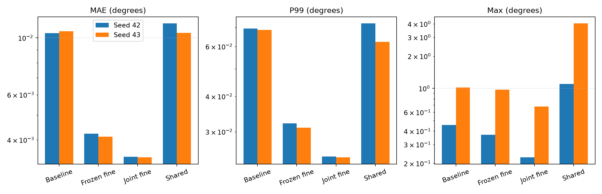

# Joint fine-tuning and shared multiscale features

Joint fine-tuning of a sequentially trained coarse and fine model reached
**0.003437° and 0.003419° validation MAE** on two seeds. This was 18.8% and
16.9% lower than after frozen-coarse refinement training, with smaller P99
and maximum errors.

A shared multiscale backbone tested a different way to retain spatial detail.
It did not consistently improve standalone Tiny. These approaches had
different total training budgets and should not be ranked as an equal-cost
comparison.

## Comparison method

Four additional training runs covered two seeds for each approach.
Each new stage used 5 200 steps, batch size 32, BF16, a 200-step warmup and
cosine decay. Data, augmentations, signed-polar preprocessing, Vector
Charbonnier loss with ε = 0.1 and MuSGD remained unchanged.

Each seed used its own checkpoints and data partition.
Models were compared on the same 15 000 validation images within that seed.
The independent test split was not used. Error is measured as the shortest
angular distance modulo 180°. P99 is its 99th percentile.

| Model | MAE, seed 42 (°) | MAE, seed 43 (°) | Parameters | Total steps |
| --- | ---: | ---: | ---: | ---: |
| Standalone Tiny | 0.0104410 | 0.0106151 | 31 363 687 | 5 200 |
| Tiny with frozen coarse and trained fine | 0.0042310 | 0.0041172 | 31 675 176 | 10 400 |
| **Tiny with joint fine-tuning** | **0.0034368** | **0.0034195** | 31 675 176 | 15 600 |
| Tiny with shared multiscale features | 0.0113818 | 0.0104520 | 28 960 871 | 5 200 |

## Joint fine-tuning after sequential training

The model started from the
[two-stage refinement checkpoint](../backbone-comparison/README.md):
5 200 coarse-training steps followed by 5 200 fine-training steps.
The third stage trained both branches together for another 5 200 steps,
bringing the total to 15 600.

The architecture retained the 192 × 33 crop within ±4°, the fine CNN with
16 → 32 → 32 channels and the correction MLP with 128 hidden features.
No parameters were added. The optimizer state was reset, and the coarse
learning rate was ten times lower than the fine learning rate.

Gradients reached coarse through the final double-angle vector rotation
and through the angle locating the differentiable crop. This let the global
estimator and local correction adapt together while limiting the size of
coarse updates.

The experiment tested joint fine-tuning after sequential pretraining.
It did not test training both branches together from their initial weights.

## Shared multiscale features

A single ImageNet-initialized ConvNeXt Tiny produced early and deep feature
maps at strides 4 and 32. Each was projected to 64 channels.
The deep map was upsampled to the early map's size, and the two maps were
combined before entering a shared regression head.

This increased angular feature-map width from 11 to 90 positions.
It used global regression rather than a local ±4° correction window.
All branches trained from the first step, with no task-trained checkpoint,
for a total of 5 200 steps.

The model was smaller than standalone Tiny, but the wider angular map
did not consistently improve accuracy. MAE increased on seed 42 and
decreased slightly on seed 43. The latter still produced a 4.04° maximum
error. This result concerns the tested 64-channel fusion design and does
not rule out other shared-backbone architectures.

## Large errors and latency

| Approach | Seed | P99 (°) | Maximum (°) | Errors above 0.1° | Batch 1 (ms) | Batch 32 (ms) |
| --- | ---: | ---: | ---: | ---: | ---: | ---: |
| Joint fine-tuning | 42 | 0.024526 | 0.227046 | 11 | 13.85 | 48.35 |
| Joint fine-tuning | 43 | 0.024363 | 0.676586 | 13 | 13.81 | 46.80 |
| Shared multiscale features | 42 | 0.072358 | 1.101261 | 81 | 12.16 | 48.51 |
| Shared multiscale features | 43 | 0.062363 | 4.038475 | 52 | 11.80 | 49.88 |

Before joint fine-tuning, the frozen two-stage model had P99 errors of
0.032107° and 0.031002°, maximum errors of 0.368420° and 0.972387°, and
22 and 23 errors above 0.1°. The extra stage improved all these measures
on both seeds.

Latency was measured on an RTX 5070 in BF16. Values are medians of
100 repetitions after five warmup calls, including preprocessing with
inputs already on the GPU. They exclude image loading and GPU transfer.

## Where predictions improved

The comparison below uses matching images for the frozen two-stage model
and its jointly fine-tuned continuation. Each cell reports seed 42 / seed 43.

| Validation group | Frozen fine MAE (°) | Joint fine-tuned MAE (°) |
| --- | ---: | ---: |
| Within 2.5° of the 0°/180° seam | 0.014814 / 0.016672 | 0.011374 / 0.012286 |
| Within 2.5° of vertical | 0.012231 / 0.010809 | 0.008560 / 0.007621 |
| Lowest target-contrast quintile | 0.008805 / 0.008328 | 0.006913 / 0.006755 |

Predictions improved on approximately 57% of images relative to the frozen
model. Gains appeared near both axes and on low-contrast lines, rather than
only in the easiest orientations.

Contrast estimates use pixels along the ground-truth direction for analysis.
They are diagnostic proxies and are not inputs to training or inference.
Individual regressions remain despite the overall gains.

## Interpretation and supporting results

Joint fine-tuning improved the sequential model without increasing its
parameter count. This study alone cannot separate the effect of unfreezing
coarse from the effect of another 5 200 training steps. It did not include
an equally long continuation with coarse kept frozen.

The shared model and standalone Tiny have an equal 5 200-step budget.
The shared model and jointly fine-tuned model do not.
The later [architecture search](../architecture-search/README.md) adds
matching-budget controls, including frozen fine continuation and fresh joint
training. It also develops a more accurate local refinement architecture.

All results concern synthetic validation data. Two seeds check consistency,
but repeated validation and the lack of independent real-image evaluation
limit broader accuracy claims.

The [full results](summary.json) retain metrics and speed measurements.
Joint fine-tuning analyses are available for
[seed 42](joint_refinement_seed42/forensics.json) and
[seed 43](joint_refinement_seed43/forensics.json).
The corresponding shared-feature analyses cover
[seed 42](shared_multiscale_seed42/forensics.json) and
[seed 43](shared_multiscale_seed43/forensics.json).
[Joint-model regressions](joint_refinement_seed43/worst_regressions.png)
and [shared-model outliers](shared_multiscale_seed43/worst_candidate.png)
show the remaining failures.
