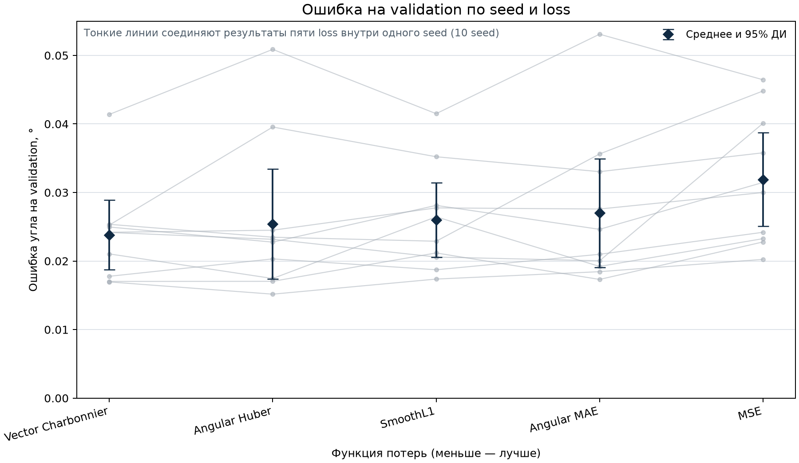
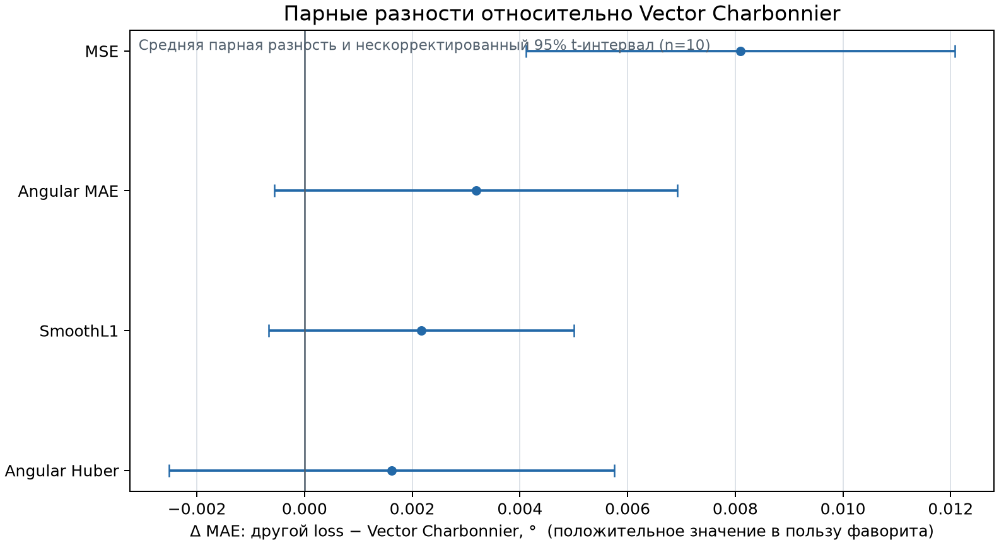
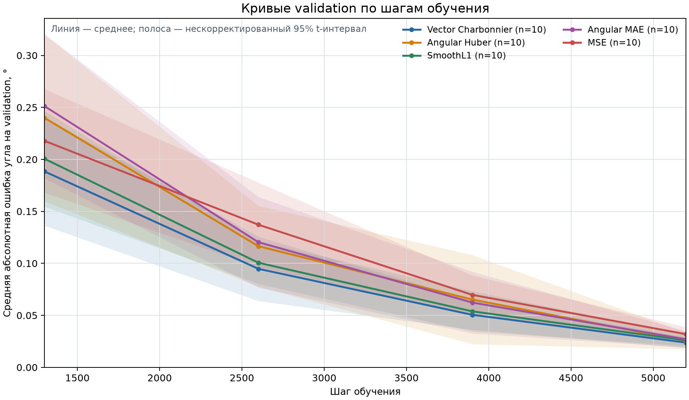

# Choosing a loss for line-angle regression

Vector Charbonnier achieved the lowest mean validation error across ten seeds:
**0.02381°**, a **25.4% reduction compared with MSE**. It also had the smallest
variation between seeds and ranked first in five of the ten comparisons.
These results led to its selection as the project's default loss.

## The problem

A line has the same orientation at θ and θ + 180°. The model predicts
`[sin(2θ), cos(2θ)]`, which gives both angles the same representation.

Five losses were compared: MSE, SmoothL1, Vector Charbonnier, Angular MAE and
Angular Huber. MSE and SmoothL1 operate on individual vector components.
Vector Charbonnier penalizes the distance between vectors. The two angular
losses operate on the shortest angle between lines.

All models were evaluated by mean absolute angular error, measured in degrees
modulo 180°. This gives every loss the same evaluation metric despite their
different training objectives.

## Study design

The comparison included **50 completed training runs**, one for each loss
and seed combination.

| Setting | Value |
| --- | --- |
| Data | `synthetic_lines_150k`, synthetic RGB images with line-angle labels |
| Model | Pretrained ConvNeXt Tiny |
| Input | Signed-polar representation, 384 × 360 |
| Seeds | 42–51 |
| Optimizer | MuSGD, learning rate 3e-4 |
| Training | 5,200 steps, batch size 32, BF16 |
| Schedule | 200-step warmup followed by cosine decay |
| Validation | Every 1,300 steps |

Architecture, optimizer settings, preprocessing and augmentations were kept
fixed. For each seed, all five losses used the same training and validation
split. Both the split and training seed changed between seed groups, so the
variation across groups includes differences in data difficulty.

The best checkpoint was selected by validation angular MAE. In all 50 runs,
the final checkpoint at step 5,200 was also the best.

## Results

The table summarizes the best-checkpoint validation MAE for each loss across
ten seeds. SD is the standard deviation between seeds.

| Loss | Mean ± SD (°) | Median (°) | Seeds with lowest error | Mean reduction vs MSE |
| --- | ---: | ---: | ---: | ---: |
| **Vector Charbonnier** | **0.02381 ± 0.00709** | 0.02418 | **5/10** | **25.4%** |
| Angular Huber | 0.02543 ± 0.01120 | 0.02297 | 3/10 | 20.3% |
| SmoothL1 | 0.02598 ± 0.00762 | 0.02467 | 1/10 | 18.6% |
| Angular MAE | 0.02700 ± 0.01111 | **0.02281** | 1/10 | 15.4% |
| MSE | 0.03191 ± 0.00953 | 0.03073 | 0/10 | Baseline |

Vector Charbonnier had the strongest average result, but it did not win on
every seed. Angular MAE had the lowest median, and Angular Huber produced
the lowest error in a single run. Comparing repeated runs changed the choice
that might have been made from one result alone.

### Paired comparisons

Each loss was compared with Vector Charbonnier on the same seed and split.
A positive difference means the alternative had higher error.

| Alternative | Mean MAE difference (°) | 95% confidence interval (°) |
| --- | ---: | ---: |
| Angular Huber | +0.00162 | [−0.00251, +0.00575] |
| SmoothL1 | +0.00217 | [−0.00067, +0.00501] |
| Angular MAE | +0.00319 | [−0.00056, +0.00693] |
| MSE | **+0.00810** | **[+0.00411, +0.01208]** |

Vector Charbonnier beat MSE on all ten seeds. Its advantage over the other
three losses was less clear: their paired confidence intervals include zero.
These are two-sided t intervals over ten paired differences, without
adjustment for multiple comparisons.

### Convergence and runtime

Mean validation error decreased at every recorded checkpoint for all five
losses. Median run times ranged from 16.32 to 16.57 minutes, with no substantial
runtime difference between losses in this setup.

## Why Vector Charbonnier was selected

The loss applies one penalty to the length of the two-component residual:

`mean(sqrt(||prediction - target||² + ε²) - ε)`

With ε = 0.1, the penalty is smooth and approximately quadratic near zero.
For larger residuals it grows approximately linearly, reducing their influence
relative to MSE. This fits the model's vector representation without converting
predictions to angles during loss calculation.

The selection rests on the observed combination of low mean error and lower
variation across seeds. The experiment does not establish why it outperformed
each alternative, or that it would do so for every dataset.

## What the results cover

These are validation results on synthetic data. No independent test-set
evaluation or real-image benchmark is included. Ten seeds provide more evidence
than a single run, but do not resolve the small differences between all of
the leading losses. Training randomness and split difficulty also vary together.

## Supporting data

[Per-run results](data/runs.csv), [validation histories](data/validation-history.csv)
and [paired seed results](data/paired-seeds.csv) contain the values behind
the tables and figures.
