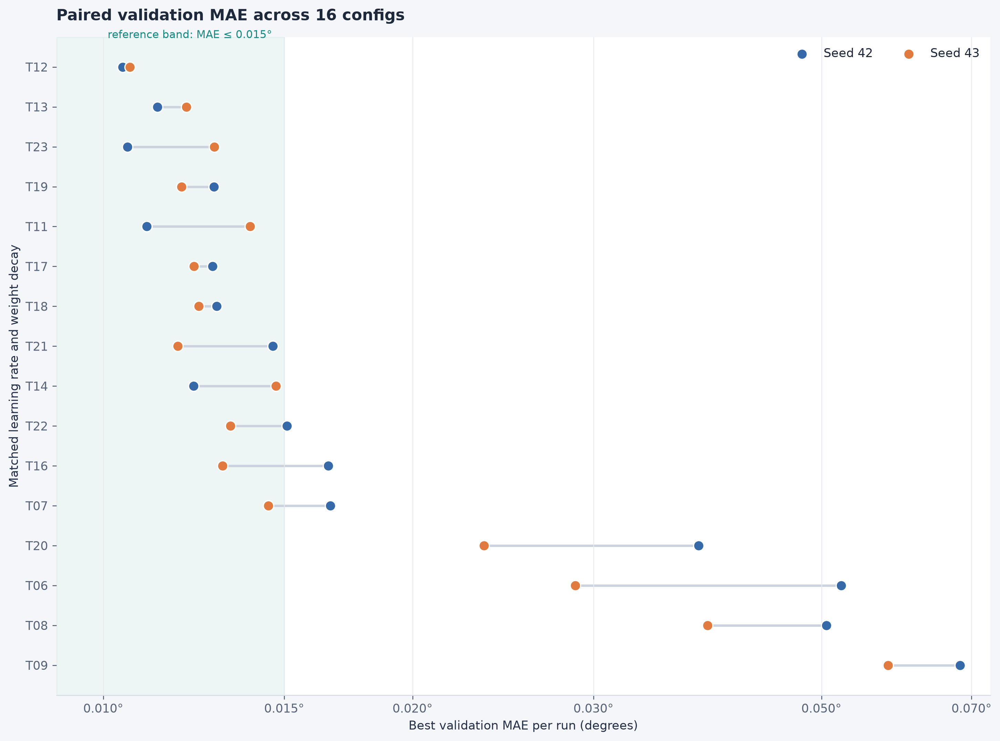
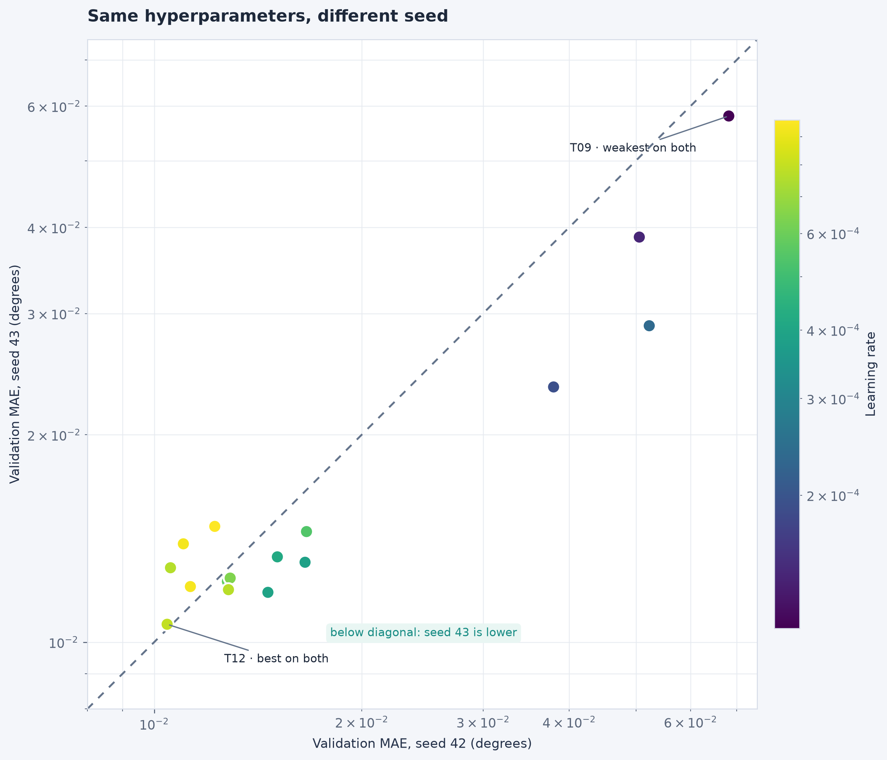
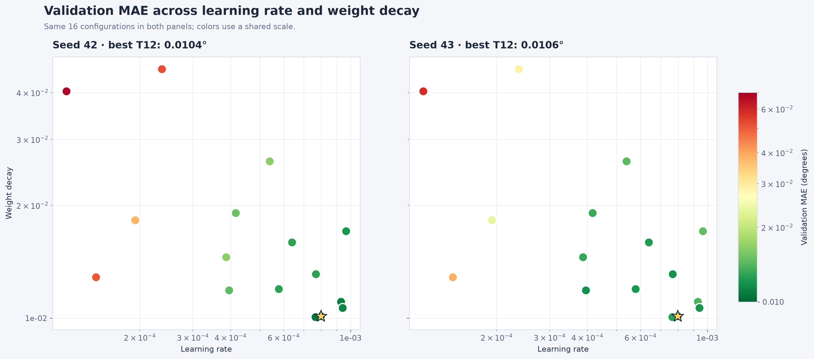

# Tuning MuSGD for line-angle regression

A search over learning rate and weight decay found one configuration that
ranked first on both seeds. Its validation angular MAE was **0.010441°** on
seed 42 and **0.010615°** on seed 43.

This study followed the
[optimizer comparison](../optimizer-comparison-seed42-43/README.md), where
MuSGD had the lowest median error among the tested optimizer configurations.

## Study design

The search evaluated 16 learning-rate and weight-decay pairs on seed 42.
All 16 pairs were then trained again on seed 43, giving **32 completed runs**.

Every run used pretrained ConvNeXt Tiny, Vector Charbonnier loss, batch size 32,
BF16 and 5,200 training steps. Momentum, Nesterov and the Muon/SGD blend stayed
fixed at 0.95, enabled and 0.7/0.3. The final checkpoint had the lowest recorded
validation error in every run.

The second seed also changed the training and validation split. This checked
whether the settings worked on another data partition as well as another
model initialization.

## Results

| Metric | Seed 42 | Seed 43 |
| --- | ---: | ---: |
| Configurations tested | 16 | 16 |
| Mean validation MAE | 0.022870° | 0.018896° |
| Median validation MAE | 0.013756° | 0.013179° |
| Lowest validation MAE | **0.010441°** | **0.010615°** |

The same configuration, trial 12, ranked first on both seeds.
Its error differed by 0.000174°, or 1.67%.

Seed 43 had lower error for 11 configurations, and seed 42 for five.
The rankings showed moderate agreement, with Spearman ρ = 0.697.
Only two configurations appeared in both top-five lists, so the best trial
transferred more consistently than the full ranking.

## Selected settings

| Parameter | Value |
| --- | ---: |
| Learning rate | Approximately 0.000798 |
| Weight decay | Approximately 0.01012 |
| Momentum | 0.95 |
| Nesterov | Enabled |
| Muon/SGD blend | 0.7/0.3 |

The learning rate and weight decay are rounded here for readability.
Exact values are included in the [paired results](paired-metrics.csv).

The stronger configurations were around learning rates of 4e-4 to 8e-4
and weight decay of 0.01 to 0.02. Learning rates below 3e-4 performed poorly
on both seeds in this search.

Learning rate and weight decay varied together. The map identifies promising
combinations, but does not isolate the effect of either parameter.

## What the results cover

The selected configuration worked well on two synthetic-data partitions.
This supports its use as the project's tuned MuSGD baseline, but does not
establish performance on real images or an independent test set.

Both validation splits informed the final choice. The second-seed replay
checks consistency, but is not a held-out test.

## Supporting data

The [paired results](paired-metrics.csv) contain all 16 configurations and
their measurements on both seeds. [Summary statistics](summary.json) include
the aggregate values and rank correlations.
