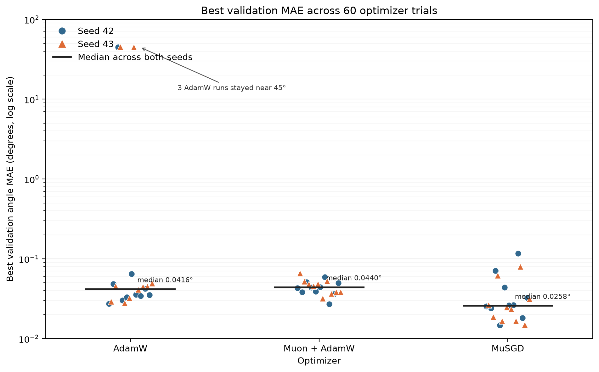

# Comparing optimizers for line-angle regression

**MuSGD produced the lowest median validation error** in a comparison of
AdamW, Muon + AdamW and MuSGD. Its pooled median was **0.025781°**, compared
with 0.041603° for AdamW and 0.044019° for Muon + AdamW.
It also produced more runs below 0.03° than either alternative.

The result justified a focused MuSGD tuning study, which later reached
0.010441° and 0.010615° on the two seeds.

## Study design

Each optimizer was tested with ten hyperparameter settings on seeds 42 and 43,
giving **60 completed runs**. The pretrained ConvNeXt Tiny model, synthetic
dataset, Vector Charbonnier loss, preprocessing and augmentations were the same.
Every run completed 5,200 training steps.

The reported metric is the lowest validation angular MAE reached during a run.
The final checkpoint was selected in 58 runs. Two high-error AdamW runs selected
an earlier checkpoint at step 1,300.

Matched settings were repeated on both seeds. Each seed also defined its data
split, so the second seed tested the setting on a different training and
validation partition.

The median summarizes each optimizer's tested settings because a few runs
had much larger errors than the rest.

## Results

| Optimizer | Median, all 20 runs | Seed 42 median | Seed 43 median | Runs below 0.03° | Runs at or above 1° |
| --- | ---: | ---: | ---: | ---: | ---: |
| AdamW | 0.041603° | 0.035482° | 0.044903° | 3/20 | 3/20 |
| Muon + AdamW | 0.044019° | 0.043476° | 0.046798° | 1/20 | 0/20 |
| **MuSGD** | **0.025781°** | **0.026281°** | **0.024046°** | **13/20** | **0/20** |

The plot uses a logarithmic scale to show both the sub-degree results and
the three AdamW runs near 45°. Markers distinguish the seeds, and the black
bar shows the pooled median.

### Sensitivity to hyperparameters

AdamW did not converge at a learning rate of 0.001 on either seed, or at
0.0006 on seed 43. The best errors for these runs were 44.85–45.28°.
They remain in the comparison because they show sensitivity to the tested
learning-rate range.

MuSGD also had a weak setting. A Muon/SGD blend of 0.2/1.0 produced errors of
0.116481° and 0.080070°. Its results were much worse than those of the
reference blend, 0.7/0.3.

### Reference configurations

The reference configuration for each optimizer was repeated on both seeds.

| Optimizer | Seed 42 | Seed 43 | Two-seed mean |
| --- | ---: | ---: | ---: |
| AdamW | 0.035622° | 0.041024° | 0.038323° |
| Muon + AdamW | 0.049905° | 0.038311° | 0.044108° |
| **MuSGD** | **0.026363°** | **0.016572°** | **0.021467°** |

MuSGD's reference configuration had the lowest error on both seeds.
All reference runs selected their final checkpoint at step 5,200.

## From optimizer selection to tuning

The strongest MuSGD setting by two-seed mean used a learning rate of 0.0006,
weight decay of 0.025 and the 0.7/0.3 blend.

| MuSGD setting | Seed 42 | Seed 43 | Two-seed mean |
| --- | ---: | ---: | ---: |
| Learning rate 0.0006, weight decay 0.025 | 0.014786° | 0.016621° | **0.015703°** |
| Learning rate 0.0003, weight decay 0.01 | 0.018182° | 0.014954° | 0.016568° |
| Learning rate 0.001, weight decay 0.025 | 0.024133° | 0.018744° | 0.021439° |

Both a higher learning rate and lower weight decay looked promising.
Their combination was explored in the
[follow-up tuning study](../musgd-tuning-seed42-43/README.md), which selected
a learning rate of approximately 0.000798 and weight decay of 0.01012.
The selected setting ranked first on both seeds.

## What the results cover

This comparison favors MuSGD within the tested configurations and training
budget. Ten settings per optimizer do not cover every possible tuning choice.
Two seeds also provide limited evidence about variability.

The results use synthetic validation data. Since the split changes with the
seed, differences between seeds include both training randomness and data
difficulty. No independent test-set result is included.

## Supporting data

[Per-run results](data/runs.csv), [validation histories](data/validation-history.csv),
[optimizer summaries](data/optimizer-summary.csv) and
[matched settings](data/matched-trials.csv) contain the measurements used
in this report.
