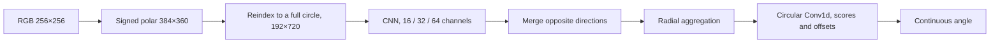

# A compact model that preserves angular resolution

PolarLine made single-image inference **2.22 times faster** and reduced the
parameter count by approximately **98 times**. However, mean error increased
from **0.010441° to 0.022096°**, and the maximum reached 14.41°.
It was not selected as a replacement for ConvNeXt Tiny in this experiment.

## Goal

The experiment tested whether a small network could preserve baseline
accuracy by keeping the angular axis of the polar image at full resolution.

ConvNeXt Tiny processes the 384 × 360 input through four feature scales.
Its final map has a spatial size of 12 × 11 and 768 channels. The regression
head recovers a continuous angle from this map, but fine line details pass
through substantial spatial compression. This motivated a separate model
that preserves the angular grid.

## PolarLine architecture

The signed-polar map contains positive and negative radii. Reindexing unfolds
them into a full circle with nonnegative radius, using the same samples
without additional interpolation.

Convolutions compress only the radial axis, preserving all 720 directions.
Circular padding connects the edges of the angular map. Averaging opposite
directions leaves 360 positions for an undirected line.

Radial mean, maximum and learned attention features are combined.
A circular Conv1d predicts a score and a small local offset for each angular
position. The decoder computes the final double-angle vector:

`θj = πj/W + tanh(offsetj)·π/(2W)`

`p = softmax(scores)`

`v = normalize(Σj pj [sin(2θj), cos(2θj)])`

At W = 360, the local offset is limited to ±0.25°. The final angle remains
continuous despite the discrete grid.

Under an angular shift on the polar grid, scores and offsets shift with the
image. This property was tested with nonzero offsets. Exact agreement under
arbitrary rotation of the original RGB image is not guaranteed because of
raster interpolation.

## Comparison setup

PolarLine was trained from scratch, while ConvNeXt Tiny used pretrained
weights. Both models used the same MuSGD settings, Vector Charbonnier with
ε = 0.1, augmentations and polar transform.

| Setting | Value |
| --- | --- |
| Data | `synthetic_lines_150k` |
| Seed | 42 |
| Training split | 120 000 images |
| Validation split | 15 000 images |
| Training | 5 200 steps, batch size 32, BF16 |
| Schedule | 200-step warmup followed by cosine decay |

The best checkpoints were reevaluated on the same validation images.
For both models, the final checkpoint was also the best.
No independent test-set evaluation was included.

## Speed and memory

Measurements used an RTX 5070, PyTorch 2.14.0+cu130 and BF16.
Timings include preprocessing. Training-step timings also include
augmentations, loss calculation, the backward pass and weight updates.
Data loading and validation are excluded. Results are medians of
15 repetitions after five warmup calls, with CUDA synchronization.

| Measurement | ConvNeXt Tiny | PolarLine | Tiny / PolarLine ratio |
| --- | ---: | ---: | ---: |
| Parameters | 31 363 687 | 319 363 | 98.2× |
| Inference, batch 1 | 11.526 ms | 5.196 ms | 2.22× |
| Inference, batch 32 | 46.627 ms | 41.967 ms | 1.11× |
| Training step, batch 32 | 157.027 ms | 104.403 ms | 1.50× |
| Peak allocated training memory | 5664 MiB | 3291 MiB | 1.72× |

The nearly hundredfold reduction in parameters did not produce a comparable
speedup. The large angular map still requires substantial computation.
A wider preliminary variant with 24/48/96 channels was slower than the
baseline at batch size 32 and was not trained.

## Accuracy

| Metric on 15 000 images | ConvNeXt Tiny | PolarLine |
| --- | ---: | ---: |
| MAE | 0.010441° | 0.022096° |
| Median | 0.006496° | 0.009482° |
| P95 | 0.031240° | 0.055354° |
| P99 | 0.069431° | 0.191469° |
| Maximum error | 0.456855° | 14.412684° |
| Errors above 0.1° | 0.427% | 2.613% |

P99 is the error threshold at or below which 99% of images fall.

Both typical predictions and rare large errors became worse.
For example, the error on image 16103 increased from 0.174° to 14.413°.
The MAE difference therefore cannot be explained by a small change in local
precision alone.

## Conclusion

Preserving angular resolution and using a geometrically consistent decoder
were insufficient to preserve baseline accuracy.
The result helped distinguish precise localization from recognizing the
correct line among distractors.

Only one PolarLine training run was completed. Capacity, pretraining and the
decoder changed along with the architecture, and the optimizer was not tuned
separately. The experiment cannot isolate each change or establish the
potential of all polar models.

## Supporting data

[Validation results](validation.json), [metric history](metric-history.csv),
[per-image errors](sample-errors.csv) and [speed measurements](speed.json)
contain the original measurements.

The representation and decoder draw on ideas from
[Polar Transformer Networks](https://arxiv.org/abs/1709.01889) and
[Integral Human Pose Regression](https://arxiv.org/abs/1711.08229),
adapted to undirected line orientation.
